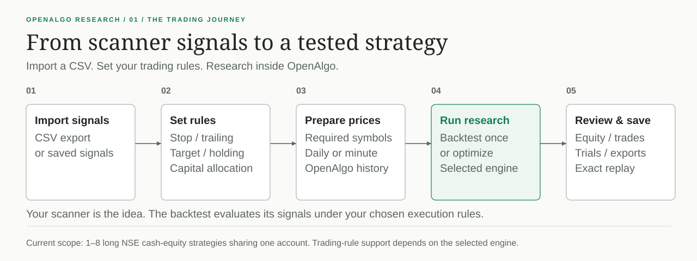

# OpenAlgo Research

**Backtest and optimize CSV signal strategies inside OpenAlgo.** One install,
one account, one broker connection, and the same Historify price archive.

This is a native distribution fork of [OpenAlgo](https://github.com/marketcalls/openalgo),
with a React interface and connectors to VectorBT, Optuna, and optional
NautilusTrader. Research manages the inputs, data preparation and results;
the connected engines perform the calculations.

Inspired by **Chartink scanner signals**: evaluate a scanner's CSV signals as a
portfolio, with your own stops, targets, trailing rules and holding periods.
The aim is to connect broker data, backtesting and optimization in one open-source
workflow. Research starts from a CSV export or saved signals.

**Current preview: `0.1.0-preview.4` · OpenAlgo 2.0.2.2 · Python 3.12**

[Download the preview](https://github.com/mamamiya7/openalgo-research/releases/tag/research-v0.1.0-preview.4)
· [Install and start](docs/research/RUNTIME.md)
· [Release notes](docs/research/releases/0.1.0-preview.4.md)
· [Architecture](docs/research/SYSTEM_MAP.md)

The development source also includes a Research library with saved experiment
drafts and setup versions, plus live CSV, price and Optuna progress and automatic
download-batch continuation. These additions are tested in the native app; the
packaged preview above remains `0.1.0-preview.4`. See the
[current implementation and verification](docs/research/EXECUTION_STATUS.md).

## What you can do

- Combine up to eight long NSE cash-equity signal strategies in one shared-capital
  backtest, with separate settings and allocation caps.
- Run daily, intraday or multiday tests using VectorBT, or select the optional
  NautilusTrader Linux/WSL runtime.
- Use Optuna to search strategy settings and allocations, with an optional
  later-period check.
- Review the account curve, each strategy's contribution, trades and trials.
  Reopen saved runs, export results, or replay selected settings exactly.

## How the tools fit together

**VectorBT is the default backtester; Optuna is the optimizer.** NautilusTrader
is an optional Linux/WSL backtester with its own supported rules. It currently
excludes trailing stops and nonzero configured slippage. See the
[engine capabilities](docs/research/CONNECTORS.md).

## Where the prices come from

Research automatically chooses daily or one-minute candles from the uploaded
signals, execution rules and full optimizer range. It reads matching prices from
**OpenAlgo's Historify database**, downloads missing required coverage through
**OpenAlgo's connected-broker history service**, and saves it into **that same
database**. Every trial uses the prepared snapshot. There is no separate research
broker connection or public-file price fallback.

## What happens during optimization

Select the settings to vary and the goal to score. Optuna searches those choices
through the selected backtester, using the same prepared data across trials.
An optional later-period check selects settings on earlier signals and evaluates
them separately on later signals. The native Research interface shows progress,
trials and saved results.

## Get started

1. Download the versioned ZIP from the preview release and extract it. The ZIP
   includes the built interface and locked dependencies.
2. Follow the [Windows/Linux setup and startup guide](docs/research/RUNTIME.md).
   Existing users should read the [update instructions](docs/research/DISTRIBUTION.md#updates-and-recovery)
   before replacing an installation.
3. Open your normal OpenAlgo address, sign in, then choose
   **Tools → Backtest & Optimize**. Upload a CSV or reuse saved signals, choose
   settings, and run. Daily and timed CSV examples are available in the screen.

The application and research worker run together in the same installation.
Nautilus is optional; VectorBT and Optuna are the default environment.

## Preview scope

Windows and Linux core workflows, exact replay and controlled fresh-install
journeys have been checked. Real broker evidence covers Fyers daily and minute
data. Other brokers use the same native integration path, but have not all been
verified against live accounts. Docker first-run/recovery and broad cross-version upgrade
coverage remain open. See the [current verification and limits](docs/research/STATUS.md).

This preview accepts CSV signal strategies for long NSE cash equities; it does
not import arbitrary engine programs or deploy live strategies. The
[connector contract](docs/research/CONNECTORS.md) lists supported execution rules.

## Development and updates

[Development](docs/research/DEVELOPMENT.md) ·
[Distribution and compatibility](docs/research/DISTRIBUTION.md) ·
[Research MCP tools](docs/research/MCP.md) ·
[Documentation map](docs/INDEX.md)

Research has its own version and dependency locks. Upstream OpenAlgo and engine
updates are integrated and checked before a new Research release; independently
upgrading those libraries is not the supported update path.

## Upstream OpenAlgo

OpenAlgo provides the host application, accounts, broker integrations, Historify
and trading tools. This repository preserves its source history and
[license](License.md). Research integration is maintained by
[@mamamiya7](https://github.com/mamamiya7).

[OpenAlgo source](https://github.com/marketcalls/openalgo) ·
[OpenAlgo contributors](https://github.com/marketcalls/openalgo/graphs/contributors) ·
[OpenAlgo documentation](https://docs.openalgo.in)
