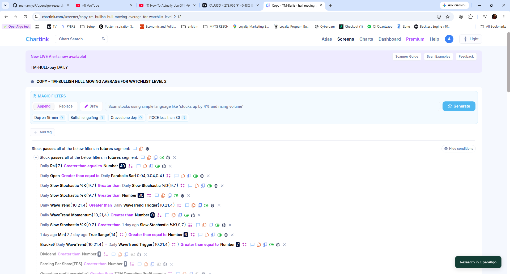

# OpenAlgo Research

**Backtest and optimize CSV signal strategies inside OpenAlgo.** One install,
one account, one broker connection, and the same Historify price archive.

This is a native distribution fork of [OpenAlgo](https://github.com/marketcalls/openalgo),
with a React interface and connectors to VectorBT, Optuna, and optional
NautilusTrader. Research manages the inputs, data preparation and results;
the connected engines perform the calculations.

Inspired by **Chartink scanner signals**: evaluate a scanner's CSV signals as a
portfolio, with your own stops, targets, trailing rules and holding periods.
The aim is to connect broker data, backtesting and optimization in one open-source
workflow. Start directly from a Chartink scanner with the Chrome extension, upload
a CSV export, or reuse saved signals.

**Current preview: `0.1.0-preview.6` · OpenAlgo 2.0.2.5 · Windows and Linux**

[**Download OpenAlgo Research**](https://github.com/mamamiya7/openalgo-research/releases/download/research-v0.1.0-preview.6/openalgo-research-0.1.0-preview.6.zip)
· [Install and start](docs/research/RUNTIME.md)
· [Release notes](docs/research/releases/0.1.0-preview.6.md)
· [Architecture](docs/research/SYSTEM_MAP.md)
· [Latest source](https://github.com/mamamiya7/openalgo-research/tree/main)

## What do I need to download?

**Download the complete OpenAlgo Research ZIP above, extract it, then run
`Setup.cmd`. Do not download `Setup.cmd` on its own.** It needs the application
files beside it. You do not need to clone or install OpenAlgo, VectorBT or Optuna
from their separate repositories.

| Component | Its job | What you install |
| --- | --- | --- |
| **OpenAlgo + Research interface** | Your account, broker connection, historical prices, research screens and saved results | Already included in the app ZIP. |
| **VectorBT** | The default backtesting engine | Setup downloads and installs the tested version automatically. |
| **Optuna** | Searches trading settings and scores them through your selected backtester | Setup downloads and installs the tested version automatically. |
| **NautilusTrader** | An optional alternative backtesting engine | Only if you want it: use the [included Nautilus installer](docs/research/NAUTILUS.md#install-the-tested-runtime) in Linux or WSL. It downloads the pinned dependencies into a separate environment; no separate Nautilus repository or web app is needed. Windows users need Linux/WSL and Linux `uv` for this optional step. |
| **Chartink Chrome extension** | Sends historical scanner signals into OpenAlgo | Optional [separate extension ZIP](https://github.com/mamamiya7/openalgo-research/releases/download/chartink-v0.1.2/openalgo-chartink-0.1.2.zip), installed in Chrome. CSV upload works without it. |

**Start with the standard setup.** Choose VectorBT for backtests and use Optimize
when you want Optuna to search settings. After installing the optional Nautilus
runtime, select it under **More settings → Backtest engine**. Optuna can search
settings supported by either engine; it is not a separate application you need
to open. Engine capabilities differ, and the app shows their supported settings.

Everything is operated through **Tools → Backtest & Optimize** in OpenAlgo:
**signals → OpenAlgo/Historify prices → VectorBT or Nautilus → saved results**.
For optimization, **Optuna proposes settings → the selected engine tests them →
OpenAlgo saves the study**. Your broker connection supplies missing price history.

### Start on Windows

1. Download the ZIP above and **extract all files** into a folder you will keep.
2. Double-click **`Setup.cmd`**. Choose your broker when asked. Setup installs
   the required Python tools and dependencies, then opens the application.
3. Create your OpenAlgo account and sign in. On **Connect Broker**, choose
   **Add broker credentials**. Save, restart with **Start.cmd**, connect your
   broker, then open **Tools → Backtest & Optimize**.

After the first setup, double-click **`Start.cmd`**. It starts the app and research
worker together. Keep the launcher open; press **Ctrl+C** there to stop both.
No separate Python, Node or Git installation is needed for the packaged Windows
download. First setup needs internet access and may take several minutes.

On Linux, extract the same ZIP and run `bash setup-research.sh`; next time use
`bash start-research.sh`. [Setup, troubleshooting and updates](docs/research/RUNTIME.md).
These launchers are for a local desktop installation. See the runtime guide for
server deployments and the optional NautilusTrader Linux/WSL environment.

The package includes the current Research library, saved setups, optimization
progress, reports, and native trade charts with entry/exit markers, visual
indicators and candle-by-candle replay. The interface is already built.
See [current implementation and verification](docs/research/STATUS.md).

## Choose how to start

| Your starting point | What to do |
| --- | --- |
| **A Chartink scanner** | Install the [Chrome extension](https://github.com/mamamiya7/openalgo-research/releases/download/chartink-v0.1.2/openalgo-chartink-0.1.2.zip), choose the scanner's historical period, then click **Research in OpenAlgo**. A named setup opens with its signals already attached. |
| **A CSV file** | Open **Tools → Backtest & Optimize**, create a setup and upload the file. No extension is needed. |
| **Saved research** | Reopen a setup in the Research library to change settings, backtest or optimize. |

### Start from Chartink

**Your scanner → your saved research.** The extension adds the button at the bottom
right. Open the scanner's historical backtest and choose its period before sending
signals. [Install the extension](extensions/chartink/README.md#install-the-extension).

1. [Download the extension ZIP](https://github.com/mamamiya7/openalgo-research/releases/download/chartink-v0.1.2/openalgo-chartink-0.1.2.zip) and **extract all files** into a folder you will keep.
2. Open `chrome://extensions` in Chrome. Turn on **Developer mode**, click
   **Load unpacked**, and select the extracted folder containing `manifest.json`.
   Open Chrome's **Extensions** puzzle-piece menu and pin **OpenAlgo Research — Chartink**.
3. Keep OpenAlgo Research running and sign in. Click the pinned extension, enter
   the same OpenAlgo address you use in Chrome, such as `http://127.0.0.1:5000`,
   then select **Connect** and allow access.
4. On a Chartink scanner, open its **historical backtest**, select the period, and
   check that **Download → CSV** is available. Click **Research in OpenAlgo** on
   the page or in the pinned extension.
5. OpenAlgo opens the saved setup. Review the signal dates and trading settings,
   then choose **Backtest** or **Optimize**. Importing saves a draft; it does not
   start a run.

**Chartink supplies the signals; OpenAlgo's connected broker supplies any missing
prices through Historify.** The extension is optional and currently installed
manually, not through the Chrome Web Store. Requires Chrome 120+ and OpenAlgo
Research preview.5 or newer. [Full extension guide, updates and troubleshooting](extensions/chartink/README.md).

## What you can do

- Combine up to eight long NSE cash-equity signal strategies in one shared-capital
  backtest, with separate settings and allocation caps.
- Run daily, intraday or multiday tests using VectorBT, or select the optional
  NautilusTrader Linux/WSL runtime.
- Use Optuna to search strategy settings and allocations, with an optional
  later-period check.
- Review the account curve, each strategy's contribution, trades and trials.
  Reopen saved runs, export results, or replay selected settings exactly.
- Inspect saved daily or minute trades on native charts, with recorded entry/exit
  markers, visual indicators and bar replay.

## Inspect a saved trade

**Saved report → Trades → View on chart → Replay**

See the trade's recorded entry and exit prices on the candles used by that run.
Add native studies such as EMA, RSI, MACD or Bollinger Bands; play, pause, change
speed, step through bars or rewind. Replay reveals candles and fill markers as
it reaches them. Closing the chart returns to the same trade table and filters.

Charts read the run's **saved price snapshot**, so opening one needs no new broker
download and does not change the result. This visual replay is separate from
**Exact replay**, which reruns saved settings through the backtesting engine.
Drawings are temporary; long trades load in sections, each with its own replay.
See [saved trade charts](docs/research/SAVED_TRADE_CHARTS.md) for details.

## How the tools fit together

**VectorBT is the default backtester; Optuna is the optimizer.** NautilusTrader
is an optional Linux/WSL backtester with its own supported rules. It currently
excludes trailing stops and nonzero configured slippage. See the
[engine capabilities](docs/research/CONNECTORS.md).

## Where the prices come from

Research automatically chooses daily or one-minute candles from the uploaded
signals, execution rules and full optimizer range. It reads matching prices from
**OpenAlgo's Historify database**, downloads missing required coverage through
**OpenAlgo's connected-broker history service**, and saves it into **that same
database**. Every trial uses the prepared snapshot. There is no separate research
broker connection or public-file price fallback.

## What happens during optimization

Select the settings to vary and the goal to score. Optuna searches those choices
through the selected backtester, using the same prepared data across trials.
An optional later-period check selects settings on earlier signals and evaluates
them separately on later signals. The native Research interface shows progress,
trials and saved results.

## Get started

Use the packaged download and the three steps above. Existing installations
should follow the [update instructions](docs/research/DISTRIBUTION.md#updates-and-recovery)
to preserve their accounts, broker settings and saved research.

To develop from a Git checkout instead, first run `npm ci` and `npm run build` in
`frontend`, then run the setup script from the repository root. GitHub's automatic
**Source code** archives do not contain the built interface; use the named
`openalgo-research-0.1.0-preview.6.zip` asset for the easy installation.

Use the [Chartink extension](extensions/chartink/README.md), or open **Tools →
Backtest & Optimize** to upload a CSV or reuse saved signals. Review the settings
and run. Daily and timed CSV examples are available in the screen.

The application and research worker run together in the same installation.
Nautilus is optional; VectorBT and Optuna are the default environment.

## Preview scope

Windows and Linux core workflows, exact replay and controlled fresh-install
journeys have been checked. Real broker evidence covers Fyers daily and minute
data. Other brokers use the same native integration path, but have not all been
verified against live accounts. Docker first-run/recovery and broad cross-version upgrade
coverage remain open. See the [current verification and limits](docs/research/STATUS.md).

This preview accepts CSV signal strategies for long NSE cash equities; it does
not import arbitrary engine programs or deploy live strategies. The
[connector contract](docs/research/CONNECTORS.md) lists supported execution rules.

## When OpenAlgo, VectorBT, Optuna or Nautilus releases an update

**Update OpenAlgo Research as one tested distribution.** An upstream release does
not automatically update this app. Each Research release specifies the OpenAlgo
and engine versions it has integrated and checked. Keep using that combination
until a newer Research release is available.

1. Check the [Research releases](https://github.com/mamamiya7/openalgo-research/releases) and read the new app release's update notes. Extension releases are labeled separately.
2. Stop the app and worker. Back up `.env`, account databases, Historify prices, strategy files and the complete research data directory.
3. Download the new **OpenAlgo Research app ZIP** and follow its [update instructions](docs/research/DISTRIBUTION.md#updates-and-recovery), preserving your private configuration and data. Run **Setup.cmd** again (Linux: `bash setup-research.sh`) to install that release's locked dependencies and apply its migrations; use **Start.cmd** for later launches.
4. If you use Nautilus, re-run its [optional runtime installer](docs/research/NAUTILUS.md#dependency-updates) when the release changes its pinned runtime. Update the Chrome extension separately only when an extension release requires it; its guide lists compatible app versions.

Do not point this installation at upstream OpenAlgo's Git repository or run
individual `pip install --upgrade` commands for its engines. Those can replace the
tested combination. Re-running Setup in an old folder does **not** download a new
Research release: obtain the new app package first. Update notes state which
migrations and upgrade paths have been verified; keep your backup for recovery.

## Development

[Development](docs/research/DEVELOPMENT.md) ·
[Distribution and compatibility](docs/research/DISTRIBUTION.md) ·
[Research MCP tools](docs/research/MCP.md) ·
[Documentation map](docs/INDEX.md)

## Upstream OpenAlgo

OpenAlgo provides the host application, accounts, broker integrations, Historify
and trading tools. This repository preserves its source history and
[license](License.md). Research integration is maintained by
[@mamamiya7](https://github.com/mamamiya7).

[OpenAlgo source](https://github.com/marketcalls/openalgo) ·
[OpenAlgo contributors](https://github.com/marketcalls/openalgo/graphs/contributors) ·
[OpenAlgo documentation](https://docs.openalgo.in)
