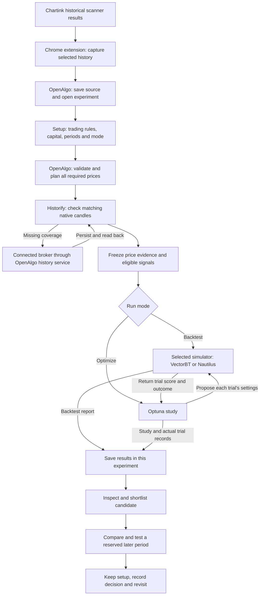

# Chartink to saved research: complete consumer journey

**Proposed experience, 11 September 2026.** This joins the browser connector to the complete [trader journey](PRODUCT_JOURNEY_MAP.md), rather than ending at CSV import. It supplements the [delivery plan](DELIVERY_PLAN.md); it does not mark proposed features as implemented. Current foundations and gaps are identified below and in [EXECUTION_STATUS.md](EXECUTION_STATUS.md).

**Execution checkpoint:** the first capture-to-saved-setup increment and suggested
search are now implemented. The native calculation path passed real
VectorBT/Optuna tests with isolated Historify data. The extension has a packaged
development build and the user reports the unpacked extension is working. Final
0.1.1 fresh-profile release acceptance remains pending, as recorded in
[STATUS](STATUS.md). [Implementation and test boundaries](EXECUTION_STATUS.md#chartink-capture-to-native-saved-setup-11-september)
and [installation steps](../../extensions/chartink/README.md) distinguish this
increment from the full proposed journey below.

## 1. The overall product requirement

A trader viewing a supported Chartink scanner should be able to click **Research in OpenAlgo**, land in a named experiment with the correct historical signals and reusable trading settings, run or optimize using their connected broker's native OpenAlgo price data, understand the result, retain a chosen setup, and return later without uploading files, copying settings, choosing databases, or losing previous evidence.

The extension is an input companion. OpenAlgo Research is the user's working application. Historify is the native candle archive. VectorBT and NautilusTrader are alternative simulators. Optuna proposes settings, calls the selected simulator repeatedly and records outcomes. It is not a stage that consumes a finished Nautilus report and independently invents new backtests.

Nautilus is optional, with its existing runtime and capability limits. VectorBT remains the default. Switching engines is an explicit new test with recorded execution differences. A second engine is not an automatic extra pass over every optimization trial.

## 2. What appears where

Only the library and the current experiment need primary navigation. Within the experiment, use **Setup · Backtests · Studies · Validation** and a compact overview/decision area. Progress and data issues are contextual drawers. A source drawer shows the original scanner and import details when requested.

| Stage and location | What the user sees and does | What happens automatically | Destination and saved outcome |
|---|---|---|---|
| One-time extension setup | OpenAlgo address and **Connect**; native sign-in/consent if required | Verify the instance and compatible research capability; remember connection | Connection ready; broker passwords and broad API keys are not copied into Chartink |
| Chartink scanner | **Research in OpenAlgo**, selected history period and compact capture state | Capture the authorized historical export, scanner identity and actual rows; distinguish historical results from today's table | Persist the import; open the native experiment only after acknowledgment |
| OpenAlgo experiment / Setup | Scanner title, source summary, a trading preset and **Backtest / Optimize** | Create or locate the experiment; fill source facts; apply a compatible saved preset | Autosaved draft; changing a field stays on this page |
| Setup review | Capital, sizing, holding/entry rules, exits and, in Optimize, search controls; **Run backtest / Start study** | Validate supported instruments, rules, costs, search bounds, calendar and data requirements | Freeze a setup version and create one retry-safe job |
| Activity drawer | **Signals → Prices → Backtest/Optimize → Saved**, real counters and elapsed time | Check Historify, acquire missing prices through OpenAlgo, persist/read back, freeze evidence, calculate and publish | Job remains linked to the experiment; navigating away leaves it running |
| Backtest result | Equity and drawdown, net return, costs, trades and strategy contribution; **Optimize this**, **Adjust & test**, **Compare** | Save complete results and their exact parent setup/data/engine references | Open a study, child setup or comparison without copying fields |
| Optimization study | Best tested score versus baseline, actual trial progress, Trials and optional Parameters exploration | Optuna evaluates declared settings on fixed evidence; retain successful, repeated, rejected and failed proposal states | Select a real trial; **Open backtest**, **Keep candidate**, **Compare** |
| Comparison / Validation | Baseline versus chosen candidates and an explicitly reserved later period | Check comparability; execute a frozen candidate on the reserved period through the same native pipeline | A separate validation report linked to the candidate and study |
| Experiment / Library | Saved work and chosen setup; **Keep**, **Reject**, **Revisit**, optional note | Results are already saved; record selection/decision separately | Return tomorrow to the same experiment, study, trial or saved setup |

The extension never asks the user to find or upload the intermediate CSV. A manual authorized history export remains a recovery option if capture is unavailable. The unsupported case must not become an empty successful import.

## 3. Auto-population versus actual user choices

One inline setup review replaces repeated dialogs. On a returning user's unchanged preset, **Run** is the confirmation of the displayed setup. First use needs deliberate financial intent; scanner membership does not encode capital, position size or exits.

| Information | Automatic/default behavior | Ask or expose only when |
|---|---|---|
| OpenAlgo address | Reuse paired instance | First connection or user switches installation |
| OpenAlgo account | Reuse native authentication | Session expired or consent is missing |
| Broker and price store | Use this instance's native broker connection and Historify | Missing required coverage needs a broker reconnect; cached coverage alone does not require a new token |
| Experiment name | Use scanner's actual title; editable | Renaming is optional and never blocks import |
| Source identity | URL, title, export/run identity where available, capture time and original bytes | Scanner identity or exported-run association cannot be established |
| History period | Use the period selected in Chartink; preserve both requested scope and actual matching dates | User deliberately wants another period; do not pretend matching dates prove full coverage |
| Symbols and source counts | Parse exact rows, preserve order and distinct times, count unique instruments separately | Invalid rows or ambiguous instrument identity require resolution |
| Market and currency | Resolve supported native instruments, exchange, timezone and account currency | Multiple mappings are possible or the product is unsupported; scanner title/segment is insufficient |
| Trading direction | Current scope is explicit long NSE cash-equity research | A short/derivative request must be blocked as unsupported, not converted silently |
| Capital and position size | Apply saved research preset; first-use starter values remain visible and editable | First run or the trader chooses a different sizing policy |
| Holding and entry timing | Apply saved preset; visible next-session entry for date-only daily rules, strictly later scheduled entry for timed observations | First use must establish intraday versus multiday intent and any clock/holding limit; timestamps alone do not mean same-day exit |
| TP, SL and trailing | Apply preset with explicit enabled/disabled states | First review or edits; trailing is offered only when supported by the chosen adapter |
| Costs and slippage | Reuse named assumptions and show a compact cost summary | First-use review, changed assumptions or incompatible engine; do not label modeled costs as verified broker charges |
| Price resolution | Infer from actual signal timing, execution rules and the full optimizer range | No database or Daily/Minute question; unresolved timing is an execution question |
| Price dates | Plan only needed symbol windows including maximum holding tails | Coverage is genuinely unavailable; details identify affected signals |
| Simulator | VectorBT default; reuse an explicitly saved compatible selection | User chooses Nautilus under More settings; unavailable/incompatible choices do not silently fall back |
| Run mode | Backtest for a new experiment; reuse context from **Optimize this** | User changes mode; clicking the mode is the choice |
| Optimization parameters | Offer a visible **Suggested search** over holding and enabled TP/SL rules; trailing only if enabled and supported | User customizes axes/ranges. Capital/costs/source data stay fixed by default. No empty-axis error on the normal suggested path |
| Search bounds | Derive valid bounded suggestions around current settings and show exact ranges before launch | The user wants different bounds; no hidden sweeping search |
| Search objective | Saved preference, otherwise existing **Balanced** objective | User changes it; explain that the current score is net return minus maximum drawdown, not an unspecified risk model |
| Search effort | Proposed **Quick: 25 trials** first-use preset; saved budget thereafter; show editable budget and supported limits | User requests a larger search. This changes the current UI's 50-trial default only when implemented |
| Research / reserved periods | Reuse the experiment's declared split; first use suggests a chronological split with visible dates | User accepts **Reserve later period** or explicitly chooses exploratory full-history research |
| Source-specific caveats | Retain Chartink history/repaint classification in source details; one compact material indicator | A property materially changes interpretation; no repeated warnings during healthy operation |

Optimizing an imported CSV changes supported execution rules and allocations. Changing Chartink's RSI, SMA or other scanner condition requires newly generated signals through a separately supported strategy-generation connector; it is not an ordinary Optuna axis in this journey.

## 4. Names, ownership and save rules

Every object has a stable internal ID. Names are editable labels, not identifiers or deduplication keys. Do not put hashes, filesystem paths or engine policy IDs in consumer titles. Reuse native name limits and numbering scoped to the parent experiment.

| Record | Default visible name | Save moment and contents |
|---|---|---|
| Experiment | Exact scanner title, optionally renamed | On acknowledged import: title, source relationship, notes/tags and connected research history |
| Source version | **Import 1 · 11 Sep 2026**, within the named scanner | On capture persistence: original export, parsed observations, counts, period, identity, precision and provenance |
| Setup draft | **Current setup** | Autosave edits; **Saving / Saved / Could not save** reflects server acknowledgment |
| Setup version | **Setup 1**, **Setup 2** | On run launch or explicit **Save setup**: source version, rules, capital, allocations, costs, periods and engine choice |
| Backtest | **Backtest 001** within the experiment | Report, equity, trades, contributions, coverage and exact snapshot/configuration versions saved before success is shown |
| Study | **Study 001 · Balanced** | Created before execution; retain baseline, objective definition, ranges, seed, budgets, versions and actual proposal history |
| Trial | **Trial 014** within Study 001 | Each accepted checkpoint: exact proposed settings, real state, score, reuse/result mapping; keep one consistent displayed numbering convention |
| Candidate | **Candidate 1**, optionally **Lower drawdown** | **Keep candidate** saves the exact trial/setup/result relationship; it does not copy or overwrite the whole study |
| Comparison | **Comparison 1** | Selected result identities, common scope and disclosed differences; view settings are separate from calculations |
| Validation | **Validation 001** | Frozen candidate and period plan before execution; separate report and exposure-to-data history after execution |
| Reusable preset | **My trading rules**, editable | Only when the user chooses **Use as my default**; save rules/costs/sizing preferences, not stale source data or prior outcomes |
| Decision | **Keep / Reject / Revisit** with date | User choice and optional note; retaining a result never means certified profitable |

For the audited example, the experiment can remain **NKS BEST BUY STOCKS FOR INTRADAY**. Its source summary would show **365 signals · 111 symbols · 22 Jan–8 Sep 2026**. Those are observed source facts, not a claim that 365 trades will execute. Market, chosen engine, dates and status are compact metadata beside a name rather than a long filename.

**No “Save results” chore:** every completed backtest and study is automatically retained in the library. **Keep candidate** records preference; **Save setup** creates a reusable named version; **Export** produces a portable report. These actions have different meanings.

Research metadata stays in the native account-owned Research store; original signals and exact snapshots stay in its managed private artifacts. Historify holds reusable native prices. Frozen snapshots preserve what a result actually used even if Historify changes later. Neither the extension nor an engine maintains another independent price database.

## 5. Return, refresh, pause and failure journeys

| Situation | Required behavior |
|---|---|
| Same import retried | Same request/capture identity returns the existing import and destination; no duplicate source, experiment or job |
| Same scanner researched again with new data | Use the related experiment by default; create a new source/draft version, preserving the previous draft/version before applying latest signals; retain its chosen trading rules |
| Same URL with edited conditions | Preserve available exported-run/query fingerprint; create new source evidence. If the relationship is unknown, do not silently label it the saved scanner definition |
| Add another scanner | Explicit **Add to experiment** action; preserve separate strategy identities and review allocations in the existing shared-capital setup |
| Back from a result | Return to its exact setup or study; edits create a child draft. **Replay exact** always uses frozen inputs |
| Trial drill-down | Open its actual detailed result or queue an explicitly labelled calculation from frozen inputs; **Back to study** restores selected trial, filters and plot context |
| Browser closed during capture | Before server acknowledgment, show an interrupted import on return and allow safe retry; do not claim it was saved |
| Browser closed after acknowledgment / during calculation | Server-saved experiment and background job survive; library restores actual progress |
| Pause requested | Proposed **Pause after current step/trial** checkpoints at a supported boundary; display Pausing until acknowledged. Instant suspension of arbitrary engine code is not promised |
| Stop requested | Preserve completed progress/evidence and real terminal state; cancellation is separate from a successful result |
| Broker token expired | One inline **Reconnect broker** action; retain downloaded coverage and return to the same job |
| Missing broker prices after a successful request | Show affected signal exclusions in a concise review; fix the eligible cohort before trials. An excluded symbol is not fully downloaded |
| Temporary acquisition batch limit | Existing bounded automatic continuation retains verified progress; no manual reset or repeated download |
| Storage or unrecoverable request failure | Retain completed work and provide one actionable issue; results are not marked saved before durable publication |
| Completed study needs more trials | Continue only after compatible study identity/budget separation is implemented; otherwise create a linked child study explicitly |
| Objective, ranges, engine or data changed | New setup/study version with parent link. Historical scores are not silently pooled into a different experiment |
| Multi-tab draft conflict | Preserve both edits; offer reload or save separately through native conflict recovery |
| App/engine update | Old results remain readable; exact replay or continuation checks compatibility and reports unavailable support before work starts |

Detailed counts and motion follow [RUN_PROGRESS.md](RUN_PROGRESS.md): signal rows, unique symbols, required/cached/new candles and real trials are distinct units. Keep one animated stage track, respect reduced motion, and avoid one notification per symbol or trial.

## 6. Study exploration, validation and the trader's decision

The normal study view answers: what was tested, whether it improved the baseline on the same evidence, how much drawdown it incurred and which real trial the user wants to inspect. **Parameters** exposes Optuna history, importance, slice, contour and parallel-coordinate views only on demand and where the actual study supports them. A region in a contour plot is not automatically an evaluated result. Clicking an unsampled region can propose a new test.

Keep candidates in a shortlist linked to their original studies. Compare against the baseline using compatible capital, prices, dates, costs and eligible signals; disclose differences before a result is called an improvement. Optional VectorBT/Nautilus comparison is a new supported engine test with explicit fill-policy differences, not a promise of identical returns.

Reserve the later period before selection. If the user chooses full-history exploration, save that intent and do not later describe part of the inspected data as untouched. The chosen trial is frozen before later-period evaluation, with the existing fresh-capital and no-boundary-crossing policies. Repeated choices using later-period results change that period's research status. Broader walk-forward and stress scenarios remain connected future branches under the main journey/delivery plan.

The final action is human: **Keep**, **Reject** or **Revisit** a candidate, optionally adding a note. **Use as starting setup** creates new research. **Export** retains the selected definition and evidence. Paper/live activation is a separate future supported workflow; optimization does not place an order.

## 7. Current foundation versus the added work

| Area | Current evidence | Work in this journey |
|---|---|---|
| Chartink input | Official CSV audited; scoped Chrome capture and native acknowledged import implemented; export parity and protocol tests pass; user reports unpacked installation working | Final 0.1.1 fresh-profile release acceptance; other scanner sites/layouts are later expansion |
| Native experiment/library | Named experiments, source URL lineage, saved drafts, duplicate reuse, changed-history child experiments, versions and results implemented | Personal presets, in-place version refresh, add to existing experiment, full context restoration |
| Data | Daily/minute planning, Historify-first acquisition, missing-only broker downloads and frozen snapshots implemented; imported source passed cache-only real-engine test | Installed extension through real-broker acceptance and broader verified broker coverage |
| Calculations | Real shared-account VectorBT, optional bounded Nautilus, Optuna search, suggested supported ranges, 25-trial new Chartink budget and later-period core implemented | Explicit effort presets, complete linked comparison/selection journey |
| Progress and recovery | Real stages/counters, acquisition continuation and compatible interrupted recovery implemented | Import progress, true user pause boundaries and completed-study continuation where supported |
| Results | Native tear-sheet statistics and Optuna plots, configurable trials, exact replay, exports and library links implemented | Continuous report and connected study/candidate exploration, shortlist, saved comparisons, richer validation-use history and decision records |

Current release scope remains up to eight long NSE cash-equity signal strategies. Other brokers use their native OpenAlgo adapters, subject to available history and verified compatibility. Derivatives, shorts and other asset classes enter through the separate [asset profiles](ASSET_PROFILES.md); an engine supporting an instrument does not establish this application's complete adapter support.

## 8. Ordered delivery and complete acceptance

1. **Capture to saved setup:** extension connection, exact Chartink history capture, import persistence, named experiment, preset review and duplicate-safe retry. End with a usable native draft, not a download notification.
2. **Setup to saved baseline:** native validation, broker/Historify preparation, truthful progress, selected simulator and automatically saved result. Exercise both daily and real timestamped examples.
3. **Baseline to study and candidate:** prefilled supported search, budget/objective, actual Optuna trials, detailed selected-trial backtest, shortlist and return navigation.
4. **Candidate to decision:** fair baseline comparison, reserved-period check, saved candidate/setup, note/decision and library reopening.
5. **Repeat and release:** refreshed scanner versions, multiple strategies, browser close/restart, broker expiry, incomplete data, conflict recovery, compatible updates and packaged installation.

These steps integrate into the existing M1/M2 library/data work, M3 study lifecycle, M4a/M4b comparison/validation, M5 input extensions and M7 return/refresh work in the delivery plan. The browser connector is a separately testable package in the same public project; OpenAlgo remains the installation/account/runtime boundary.

**The acceptance story:** connect once; visit a Chartink scanner; click Research in OpenAlgo; review the automatically named experiment and saved rules; run a baseline on a declared selection period; optimize enabled settings; inspect and keep a real trial; compare it to the baseline; evaluate it on the reserved period; record a decision; close the browser; reopen that exact work tomorrow; refresh the scanner into a new version without changing yesterday's results. Repeat using manual upload of the same export and the same frozen prices to prove numerical/input parity.

This story is the completion target. The audited CSV alone proves the input boundary, not the whole journey.
