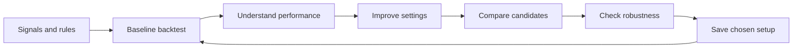

# Research journeys and frontend coverage

The comprehensive target is now mapped in [PRODUCT_JOURNEY_MAP.md](PRODUCT_JOURNEY_MAP.md), with [asset-specific profiles](ASSET_PROFILES.md) and an [interactive visual map](trader-journey-map.html). This document retains the source-based coverage review and initial page proposal.

The [integrated delivery plan](DELIVERY_PLAN.md) assigns implementation and acceptance work across all journeys, assets and release requirements.

For changes since this source review, see the [implementation checkpoint](EXECUTION_STATUS.md).

Reviewed 10 September 2026 against source revision `94d1043fa6f7b1a75cec22ca0a4fd093e288464b`, VectorBT 0.28.5 and Optuna 5.0.0.

This is a source-based journey review and a proposed next product milestone. It does not certify the current visual experience, rerun acceptance tests, or mark the proposals below as implemented. [BRIEF.md](BRIEF.md) remains the product commitment; [STATUS.md](STATUS.md) records delivered scope.

## The unit of completion

A user must be able to answer a research question and carry the answer into the next decision. Installing engines, returning metrics, and passing component tests do not by themselves complete that journey.

The main research loop is:

OpenAlgo owns the broker connection and Historify. Our layer turns user choices into consistent data requirements and engine requests, then preserves and presents the results. VectorBT owns simulation and account calculations. Optuna proposes and scores parameter choices through the selected simulator. Optional Nautilus changes the simulation engine, not the consumer journey.

## Engine workflows we can reuse

VectorBT's community edition supports signal/indicator construction, portfolio simulation, parameter combinations, performance and trade analysis, and chronological splitting. Its pinned repository includes a focused candlestick-pattern Dash app and a walk-forward example. It is not a general ready-made frontend for all our workflows.

Optuna supports study/trial search, optimization history, parameter importance and relationship plots, and multiple objectives. Its optional Dashboard is a frontend for studies. It does not understand trading signals, broker data, portfolio execution rules or untouched validation periods by itself.

Relevant primary sources:

- [VectorBT pinned portfolio API](https://raw.githubusercontent.com/polakowo/vectorbt/v0.28.5/vectorbt/portfolio/base.py)
- [VectorBT focused application example](https://github.com/polakowo/vectorbt/blob/v0.28.5/apps/candlestick-patterns/README.md)
- [VectorBT walk-forward example](https://github.com/polakowo/vectorbt/blob/v0.28.5/examples/WalkForwardOptimization.ipynb)
- [Optuna search spaces](https://optuna.readthedocs.io/en/v5.0.0/tutorial/10_key_features/002_configurations.html)
- [Optuna visualization and Dashboard](https://optuna.readthedocs.io/en/v5.0.0/tutorial/10_key_features/005_visualization.html)
- [Optuna multi-objective studies](https://optuna.readthedocs.io/en/v5.0.0/tutorial/20_recipes/002_multi_objective.html)
- [Optuna persistent studies](https://optuna.readthedocs.io/en/v5.0.0/tutorial/20_recipes/001_rdb.html)

These are community VectorBT capabilities, not VectorBT PRO claims. Reusing a capability still requires an adapter that preserves our financial semantics.

## Current journey coverage

| User question | Existing capability and native frontend | Missing transition or decision support |
| --- | --- | --- |
| **1. Can I test my signals?** | Upload/reuse one to eight CSVs; configure execution, allocations and shared capital; run a VectorBT backtest. Daily/minute selection and missing Historify coverage are automatic. | The current entry point assumes signals already exist. Creating a strategy from indicator rules is a separate input journey that VectorBT can support but our connector does not expose. Keep this an explicit scope distinction. |
| **2. Did it work, and why?** | Summary, equity chart, strategy contributions, filtered trades, outcome reasons and recorded settings exist. | No benchmark overlay, chart-period-to-trade investigation, or completed-result comparison in this flow. Show comparison and diagnosis on demand; do not add every metric to the overview. |
| **3. Can I improve this exact baseline?** | The builder has Optimize, parameter ranges, allocations, objectives, TPE/grid and a trial budget. | A completed result cannot directly populate an editable setup or an optimization from its saved configuration. Its actions are exact replay and export. Preserve a baseline link and original settings when creating the new experiment. |
| **4. What did optimization teach me?** | A ranked trial table shows return, drawdown, trades, settings and “Backtest this.” | No search-history view, parameter importance/relationship exploration, candidate shortlist or improvement versus the original baseline. Reuse Optuna analysis and present it as answers to specific questions. |
| **5. Which tradeoff should I choose?** | Current objectives select one scalar winner: return, drawdown, or return minus drawdown. Individual candidates can be replayed. | No direct shortlist comparison or “keep this candidate” workflow. A return/drawdown scatter from existing trials can help before adding true multi-objective search. Do not call scalar search a Pareto optimization. |
| **6. Does it hold up beyond the fitted sample?** | Optimize offers a fixed earlier-80%/later-20% check; earlier and later reports stay separate. The engine prevents positions crossing the split. | No dedicated validation from a saved candidate, rolling evaluation, nearby-parameter analysis or linked cost/slippage scenarios. A period already used to choose settings cannot later be labelled untouched. |
| **7. Do these strategies work better together?** | Shared-cash simulation, per-strategy allocation ranges and reconciled contribution results exist. | Contributions are not standalone backtests. There is no linked combined-versus-separate or alternate-allocation comparison showing the change in account risk. |
| **8. Can I continue and reuse my research?** | Saved runs, interruption recovery, exact exports and frozen-price replay exist. | No completed-result-to-editable-version flow or named reusable setup library. “Run again” currently means exact replay, not update data or improve the strategy. Continuing an interrupted search is not extending the budget of a completed study. |

## Source evidence for the gaps

- [Research entry](../../frontend/src/pages/ResearchEntry.tsx): new portfolio screen is the default; earlier scanner screens require the legacy route.
- [Portfolio page](../../frontend/src/pages/PortfolioResearch.tsx): `newRun` clears the draft; `editSetup` exists but its control is rendered only for non-completed jobs. Completed reports receive replay and export actions.
- [Portfolio builder](../../frontend/src/components/research/PortfolioBuilder.tsx): Backtest/Optimize, search objective/budget and optional fixed holdout. The later-period control appears only in Optimize.
- [Strategy settings](../../frontend/src/components/research/PortfolioStrategySettings.tsx): supported execution controls and numerical ranges, rather than a general indicator strategy builder.
- [Result screen](../../frontend/src/components/research/PortfolioResults.tsx): one equity series, Summary/Trades/Settings/Trials, exact replay, exports and per-trial “Backtest this.” No baseline or saved-run comparison is wired here.
- [Portfolio coordinator](../../services/research_portfolio.py): prepares prices, selects simulator, optionally partitions the sample, and calls Optuna with the selected evaluator.
- [Optuna adapter](../../research/connectors/optuna_portfolio.py): an in-memory study with exact JSON checkpoint/replay, one scalar objective and numerical axes. Allocation rejection uses `TrialPruned`; this is not performance-based early stopping of expensive trials.
- Full completed/pruned proposal records, including repeats, already exist separately from the deduplicated ranked table. Rich study exploration needs to expose that evidence; it must not invent trial history from the ranking. Total trial budget currently participates in checkpoint identity, so completed-study extension needs a versioned identity/budget separation.
- [Validation](../../research/portfolio_validation.py): chronological partition before search, maximum holding-window checks, no carried positions.
- The fixed split uses unique signal dates. Existing `ResearchHistory` records usage, but the overlap warning path is in the legacy research flow; the new portfolio validation must integrate that history explicitly. Current drafts are account-keyed session storage, not durable server drafts.
- [Journey tests](../../frontend/src/components/research/PortfolioJourney.test.tsx): coverage of the current UI paths; their presence is not evidence of the missing transitions being implemented.

The older scanner has some analysis functions, including sensitivity. Their existence does not establish support in the new joint VectorBT/Optuna workflow. Port them only if the adapters and evidence contract are appropriate.

## Proposed next milestone: complete the research loop

### First: connect existing steps

Add context-preserving actions to completed results:

- **Adjust and test:** open an editable version of the exact saved setup, with source identities and selected settings intact.
- **Optimize this:** start an optimization from that configuration, retaining a link to its baseline.
- **Compare:** show the baseline and selected candidate on matching periods, price evidence, costs and eligible signals. Identify differing assumptions rather than presenting mismatched runs as a clean improvement.
- **Save setup:** retain a named, reusable selected configuration separately from immutable result evidence.

Keep **Replay exact result** a separate action from these. Editing must create a new version; it must not alter old results or silently refresh prices.

### Second: make the search understandable

Use an optional “Explore optimization” view for:

- improvement history;
- return versus drawdown among tested candidates;
- which searched settings matter within this study;
- nearby parameter behavior;
- selecting a small shortlist and carrying the choice into a normal backtest.

Reuse Optuna's analysis APIs where compatible. Our current JSON checkpoints are not a persistent Optuna database, so embedding Dashboard is not a zero-work replacement. A read-only Study reconstruction or explicit storage bridge needs testing. Importance needs sufficient varied trials and must not be presented as proof of future reliability.

The default result remains concise. Analysis appears when the user chooses to investigate.

### Third: close the validation decision

Give a selected configuration a validation journey with a clear origin, frozen settings and a declared period:

- Start with the existing chronological holdout and make the earlier/later comparison understandable.
- Add rolling evaluation by adapting established splitters and the existing engine contract, not another backtest engine.
- Add bounded nearby-setting and cost/slippage scenarios using the same simulator.
- Track periods used for selection. Repeatedly picking candidates using later-period scores makes that period part of selection.
- Save the configuration together with what was tested and the outcome.

Signal-generation templates, true multi-objective studies and advanced Dashboard access are later branches. They should enter the plan through a specific user question, not because the libraries expose additional controls.

## Completion scenario

An intended user can upload two existing CSV strategies, reserve a validation period before using its results, run a baseline on the selection period, understand a weak result, optimize selected rules without re-entering the setup, compare a shortlist against that baseline, inspect an honestly separated validation result, save a chosen version, leave, and reopen or adjust it later.

The entire sequence stays in OpenAlgo. Each result retains its exact inputs, prices, settings and parent relationship. No step requires Python, another broker setup, manual interval selection, or copying settings between screens.

This is the next product-completeness target. Installation and release operations remain necessary acceptance work, but they do not substitute for completing this research journey.

## Proposed pages and native interactions

Added 10 September 2026 following the user's request to expose the native exploratory workflows of Optuna and VectorBT. This section proposes page behavior; none of these added views is claimed implemented.

Use one Research area with three primary views and a shared comparison/validation view:

| View | What the user works with | Main interactions |
| --- | --- | --- |
| **Research library** | Named experiments, each linking setup, baseline backtests, optimization studies and selected candidates | Create an experiment, reopen a result or study, continue an interrupted job, duplicate a setup |
| **Backtest** | A particular VectorBT portfolio result | Explore performance, drawdown, trades and strategy contributions; zoom a period; inspect a trade's underlying candles; compare a baseline; adjust the setup or optimize it |
| **Optimization study** | An Optuna Study containing actual Trials | Inspect progress, parameter importance, relationships and trials; change plotted parameters; filter or shortlist trials; open a selected trial as a normal backtest |
| **Compare & validate** | A baseline and explicitly chosen candidates | Compare aligned results, inspect separately reserved periods, run declared validation/scenarios, retain a chosen setup |

The names can remain consumer-friendly, with “Powered by VectorBT” or “Optuna study” in contextual detail. A user should never have to copy parameters between the study and the backtest.

### Backtest view

Keep Performance, Trades, Drawdowns and Settings as focused tabs or subviews. Use the selected engine's actual results and supported plotting/statistics functions.

The first view shows the main account outcome and equity curve. A user can then inspect a loss period, relevant trades, allocations and costs. A selected trial from Optuna opens this same view with the exact parameters and price evidence that produced it. Provide clear navigation back to the originating study.

VectorBT's [Portfolio API](https://vectorbt.dev/api/portfolio/base/) supports plotting and statistics around the portfolio object. This is a Python/notebook-oriented interface, not a universal standalone GUI. Any added engine-specific metric or chart must be checked against pinned 0.28.5 and its saved inputs.

### Optimization study view

Use four focused sections, rather than a page for every chart:

| Section | Views | Interaction and question answered |
| --- | --- | --- |
| **Overview** | Optimization history and selected summary | Hover a trial, inspect improvement over the search, jump to that trial |
| **Parameters** | Importance, slice, contour, parallel coordinates | Select an objective/display metric and parameters; investigate which searched settings influence results, how one setting behaves, and how combinations relate |
| **Trials** | Sortable/filterable trial table and trial details | Inspect exact settings and outcome, shortlist candidates, select “Open backtest” |
| **Compare** | Baseline/candidate comparison and return/drawdown plot | Compare meaningful alternatives and carry a selected configuration into validation |

Keep the native chart names as secondary labels: **Parameter relationships · Contour**, for example. Experienced users can recognize the analysis while first-time users can understand its purpose.

Use Optuna's [official visualization functions](https://optuna.readthedocs.io/en/v5.0.0/tutorial/10_key_features/005_visualization.html) for the analyses. Add EDF/rank plots as additional views when they answer the user's question. Timeline requires actual recorded timing. Intermediate-value charts require recorded intermediate measurements. Pareto analysis requires a multi-objective study; a scalar return/drawdown score does not qualify.

An illustrative interaction sequence:

1. Open a completed study and inspect which searched parameters are important.
2. Choose maximum holding period and stop loss in the contour view.
3. Inspect actual sampled trials in a promising region and shortlist two.
4. Open each trial's exact VectorBT backtest and compare it with the baseline.
5. Select one configuration for an honestly separated validation run, then save it.
6. If desired, use a chosen region to prefill a new search; the old study and its evidence remain intact.

Contours can include interpolation between sampled settings. Clicking an unsampled location must create a proposed configuration for evaluation, not pretend it is an existing tested trial. Parameter importance describes this study's observed results, not future profitability. Changing the display metric must not silently change the original optimization objective or scores.

### Reuse approach

The preferred first implementation is official Optuna Python visualization functions returning Plotly figures, rendered interactively in the native OpenAlgo page. Reuse VectorBT statistics/plotting where appropriate and preserve the engine's calculation assumptions. Our additions are the page organization, study/result linkage, filtering and actions.

Optuna also provides an actual [Dashboard](https://optuna-dashboard.readthedocs.io/en/latest/) and a [WSGI integration interface](https://optuna-dashboard.readthedocs.io/en/stable/_generated/optuna_dashboard.wsgi.html). A managed Dashboard view is an alternative for fuller upstream interaction, subject to study storage, authentication, request routing and worker compatibility verification.

Do not assume its React source is a supported installable SDK: the currently inspected [@optuna/react package](https://raw.githubusercontent.com/optuna/optuna-dashboard/main/tslib/react/package.json) is marked private and uses internal workspace packages. Prefer the documented visualization API or a tested Dashboard integration over depending on private internals.

### Required connector work

- Expose complete recorded Study/Trial information, distributions, objective identity and trial state to Optuna analysis. The existing in-memory study and JSON checkpoints need an analysis adapter or deliberately integrated persistent study storage. Preserve existing exact replay semantics.
- Keep trial parameters, candidate settings, result identity and price snapshots linked. Use original trials for study analysis; repeated or rejected proposals must not be silently substituted with only the deduplicated result table.
- Keep engine-native analysis available without requiring unsafe arbitrary object deserialization. Historical inputs and version identity must be sufficient for any declared reconstruction.
- Provide validated figure data and load only the required Plotly traces. The current 2D build has scatter/bar/candlestick; contour, heatmap and parallel-coordinate support is additional work.
- Broker prices remain in Historify. Study storage contains optimization metadata; it must not create a second market-data download path.
- Render honest unavailable states when the data does not support a plot. Recorded timing and intermediate evaluation must not be invented for old runs.

This extends the previously proposed journey milestone into concrete page behavior. It reuses the tools' analytical strengths while keeping the user's research, broker context and results together.
