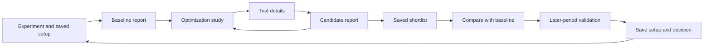

# Research reports and study exploration — delivery specification

**In progress, 11 September 2026.** This is the presentation and journey increment
requested after reviewing the QuantStats reference. Section 11 records the first
implemented and tested slice; the whole specification is not complete.
The preceding calculation foundation and its acceptance remain in
[TEARSHEET_PLAN.md](TEARSHEET_PLAN.md). This specification refines the P5/P6/P7/P8
journeys and M2/M3/M4a packages in [DELIVERY_PLAN.md](DELIVERY_PLAN.md).

## 1. Outcome and saved decisions

A trader opens a result and can immediately understand growth, losses, consistency
and trade behavior. A trader opens an optimization study and can understand what
was searched, whether the search improved, which settings mattered and which
candidate merits further testing. Every candidate leads to its own exact report.
The final loop ends in a saved candidate, comparison, validation and decision.

**Design decision RPT-01:** adopt the reference's coordinated charts and grouped
statistics in a continuous report. Replace the main one-chart dropdown with visible
sections. Retain native OpenAlgo navigation, typography, light/dark themes and UI
components. A complete report must not require selecting every chart separately.

**Architecture decision RPT-02:** OpenAlgo/Historify owns broker data; VectorBT or
Nautilus owns simulation; Optuna proposes settings and records objective outcomes;
our layer connects evidence, saves work and presents these results. A study and a
portfolio report have different identities and different numbers.

### Parked ideas — explicitly retained for later

| ID | Idea | Revisit trigger and completion question |
| --- | --- | --- |
| QS-01 — pinned | Optional QuantStats reporting connector, including portable HTML reports | After the core report and study-to-candidate journey pass acceptance, before choosing the final export implementation: can the existing library remove substantial reporting work while accepting our frozen account returns and benchmark, preserving definitions and avoiding its own market-data downloads? Evaluate VectorBT's existing QuantStats adapter first. |
| OD-01 | Optional embedded upstream Optuna Dashboard | After durable Study/Trial identity, storage and host authentication compatibility are proven: does it add useful interactions beyond the native study page without another user account/server setup or coupling to private dashboard internals? |
| ADV-01 | True multi-objective search, intermediate learning curves, statistical termination and rolling walk-forward | Resume under M4b/M5 only after their actual evaluation observations, constraints and causal validation contracts exist. A chart option alone does not enable these capabilities. |

QS-01 is a saved backlog item, not a new package dependency or a scheduled reminder.
The visual direction is active now; library adoption is a separate bounded decision.

## 2. Current foundation versus work to deliver

Source inspection on 11 September supplements the historical acceptance in STATUS.
The existing Graphify graph provides orientation but predates some new analysis
files; current source is authoritative for the distinctions below.

| Area | Available now | Required in this increment |
| --- | --- | --- |
| Calculations | Shared-account summary; applicable native statistics; 121 VectorBT / 88 Nautilus catalog entries; full scalar analysis per new distinct trial | Curated semantic mappings, period consistency, benchmark report overlay and missing return/drawdown summaries; catalog counts are not counts of unique financial concepts |
| Tear sheet | Continuous report with coordinated panels, section navigation, searchable metrics, frozen prices/fills, account-saved preferences and month/drawdown investigation | Complete reference-field classification and ordinary-app acceptance of the new increments |
| Study | Recorded proposals, scores, distinct configurations, native plots and two parameter selectors | Dedicated study landing view, chart-to-trial interactions, linked trials, reliable counts, shortlist and comparisons |
| Candidate reports | Winner report retained; other configurations can be replayed on frozen inputs | One visible candidate selection, direct report links and durable evidence links for requested candidate reports |
| Validation | Frozen reserved-period contract, baseline/search selection-only mode, explicit candidate evaluation and period/candidate identities; legacy both-period reports stay readable | Fair comparison and a visible evidence-use history; saved decisions and complete return navigation |
| Persistence | Saved experiment/setup/job relationships, account-saved report preferences and separate analysis artifacts | Saved candidates, comparisons, decisions and full navigation restoration |
| Benchmark | Explicitly unavailable without aligned independent evidence | Native Historify benchmark selection, missing-only acquisition, frozen reporting evidence and actual relative statistics |
| Export | Exact evidence and analysis JSON downloads | Reader-friendly report HTML/print output, linked study context and saved comparison export |

Relevant implementation entry points: [results](../../frontend/src/components/research/PortfolioResults.tsx),
[analysis UI](../../frontend/src/components/research/PortfolioAnalysis.tsx),
[trials](../../frontend/src/components/research/PortfolioTrials.tsx),
[account/native analysis](../../research/analytics.py),
[Optuna connector](../../research/connectors/optuna_portfolio.py),
[Optuna figures](../../research/study_analysis.py),
[saved analysis service](../../services/research_analysis.py),
[library metadata](../../database/research_db.py).

## 3. Page and navigation contract

Keep the existing Research library and experiment shell. Eliminate the duplicate
long result title and redundant back-navigation inside that shell. Keep old saved
URLs resolving to their original evidence. Add view/section/candidate state to the
existing research route; do not require a separate website.

| Context | Page contents and primary action | Return/save behavior |
| --- | --- | --- |
| Ordinary backtest | **Report · Trades · Settings**; Report is the default, replacing separate Summary/Tear sheet tabs. Primary action: Optimize this | Existing result URLs open the same result. Old Summary/Tear sheet links map to the appropriate Report section |
| Study | **Overview · Parameters · Trials · Shortlist**. Primary completed-state action: Open best report | Study opens study-wide evidence, with a compact best-candidate preview. It does not silently open the winner's entire report as the study itself |
| Candidate report | Same Report/Trades/Settings layout; breadcrumb includes Study / Trial 67, plus Best by objective or Chosen by you as applicable | Back to study restores section, axes, filters, page, candidate and scroll position |
| Comparison | Two to four retained candidates, with baseline when available; common metrics and aligned plots. Primary action: Validate candidate | Save comparison with explicit member/period/report versions. Back restores shortlist |
| Validation | Candidate's selection-period and later-period results clearly separated. Primary action: Save decision | Preserve the candidate and study link; saving a decision does not overwrite the study's mathematical winner |

Settings opens a dialog/drawer from a trial row, with keyboard focus restored on
close. A full report is a destination, not content appended below a long trial
table. Browser Back, refresh and direct links must retain meaningful context.

## 4. Exact report composition

### First screen and layout

- One compact header: result name, evaluated dates, engine, data interval and
  optional linked Trial number. Source detail belongs in a small provenance drawer.
- One action group: primary action for this context; shortlist/bookmark and export
  are secondary; replay and advanced actions belong in the overflow menu.
- A plain row of six key values: net return, net P&L, maximum drawdown, Sharpe,
  closed-trade win rate and closed trades. Avoid six separate bordered cards.
- On desktop, use approximately two-thirds width for cumulative return with
  underwater directly beneath it, and one-third for grouped performance statistics.
  Do not draw available cash over the main performance curve.
- Sticky section links: **Performance · Consistency · Risk · Trades · All statistics**.
  Scrolling is the default reading interaction; each chart can expand when needed.
- At 390px width, stack sections, keep the KPI row compact and contain table
  scrolling within its own region. At 1440 × 900 the first performance chart and
  headline values must be visible without navigating tabs or scrolling past titles.

### Section inventory

| Section | Visible by default | Secondary controls / drill-down | Source and remaining work |
| --- | --- | --- | --- |
| Performance | Cumulative account return; benchmark if selected; underwater; compact grouped statistics | Return % / equity value toggle; linear / log toggle where values permit; benchmark control; expand chart | Reuse saved account curve. Add compatible benchmark overlay; log view must not hide nonpositive equity |
| Statistics beside performance | Starting/final capital, net P&L, return, session-annualized return; Sharpe, Sortino, maximum drawdown, volatility; closed-trade count/win rate/profit factor and average net trade P&L | Definitions on demand; Customize opens a small chooser; all native fields remain accessible below | Reuse explicit shared-account metric keys. Preserve native definitions under provider groups rather than silently merging them |
| Consistency | Monthly return heatmap and daily return distribution | Daily/monthly distribution selector; annual returns and return quantiles expandable | Monthly/daily/yearly plots exist. Add quantiles from complete return series. Empty/future months remain blank; partial periods are marked |
| Risk | Rolling Sharpe and volatility together; worst five drawdown episodes with dates, depth and recovery duration | 21/63/126-session window controls; rolling Sortino, deeper drawdown table and highlighted drawdown intervals | Existing rolling window is 21 sessions. Add other windows, Sortino and engine-independent episode extraction from full marked curve |
| Trades and capital | Closed-trade P&L distribution, P&L versus holding duration, exposure over time, strategy contributions | Symbol/strategy contributions; costs and cash utilization; open a trade and its actual saved bars/fills | Reuse ledger/exposure/attribution evidence. Add grouped summaries; reconcile every contribution with the account total |
| All statistics | Searchable, grouped complete catalog, collapsed initially | Returns, Risk, Trades, Capital, Native engine; unavailable fields show one short reason on request | Keep all applicable statistics calculated and saved; the default report displays a curated set |

Default chart colors remain consistent across the report: portfolio primary,
benchmark secondary, losses/drawdown a distinct loss color, zero neutral. Use clear
axes, restrained grids, readable ticks and shared dates for linked performance
panels. No perpetual animation after loading; short transitions respect reduced
motion. Short reports omit empty advanced chart blocks rather than filling the
page with unsupported-feature messages.

Hover and zoom are view changes. They do **not** recompute the report's headline
statistics or Optuna score. A month or drawdown click opens a contextual breakdown
with its own dates, without replacing whole-period statistics. Creating a new
research period is an explicit new test, with separate evidence.

## 5. Optuna study dashboard and its numbers

Use native Optuna figures inside the application. Its dashboard is a reference
for exploration; embedding the upstream dashboard is not a prerequisite.

| Study section | Visible content | Interaction and destination |
| --- | --- | --- |
| Overview | Objective and direction; budget/progress; distinct portfolios and reused proposals; best score and comparable baseline score/delta; score history with best-so-far; return versus drawdown scatter | Click a real trial point to open candidate details. Scatter is labeled a comparison, not Pareto optimization. Best report opens that configuration's report |
| Parameters | Parameter importance next to parameter slice; contour below for two chosen parameters | Choose parameters with readable strategy names; inspect an observed trial. Contour background interpolation is not a tested candidate and is not clickable as one |
| Advanced parameter views | Parallel coordinates, rank and objective distribution (EDF) | Expand only when wanted; brush/filter affects displayed trials, never the original study's recorded best configuration |
| Trials | Distinct portfolios by default, sortable configurable columns and stable trial identity; include Score, Return, Max drawdown, Sharpe, Win rate, Profit factor, Closed trades | Row opens settings and metrics; Shortlist; Open report or Prepare report. Toggle All proposals for reused/rejected/unfinished states. Nulls sort last; sort uses numeric values |
| Shortlist | Retained candidates with optional note, chosen badge and report/validation availability | Compare 2–4; validate one; save setup; remove bookmark without deleting evidence |
| Activity | Compact current stage, elapsed time and completed proposals while running; detailed timing available on demand | Native timeline only where real times exist. Closing the browser does not cancel a job. Do not label price-download progress as trial progress |

Keep unsupported charts out of the normal menu. Intermediate-value plots require
recorded steps; Pareto and hypervolume require a real multi-objective study;
terminator plots require the appropriate error/improvement evidence. None can be
inferred from a single completed objective value.

### Counts and ranking contract

- A **proposal/trial** is one Optuna trial, including a repeated configuration or
  allocation rejection. Display trial number as the stored zero-based number + 1
  in chart tooltips, tables, breadcrumbs and human-readable exports. Original
  exact-evidence JSON retains its stored zero-based number unchanged.
- A **distinct portfolio** is one feasible unique configuration actually evaluated.
  Store and display its configuration identity and link repeated proposals to it.
- **Reused** means the same configuration's saved result was reused, not that
  new candles or a new engine simulation were required.
- Distinguish allocation rejections from performance-based pruning. Current
  rejected allocations use Optuna's pruned state, but no learning-curve pruning
  occurred. Failed, active and waiting proposals are separate where recorded.
- Example with no rejections: **100 trials · 65 portfolios · 35 reused**. This
  means 65 distinct evaluations, not 100 independent performance samples.
- In a successful completed study, proposals = distinct feasible evaluated
  configurations + reused proposals + allocation rejections. Keep unfinished or
  failed states separate when inspecting an interrupted study. Derive counts from
  actual records; current `evaluated_this_pass` / `evaluated_all_passes` fields do
  not prove how many evaluations occurred in the latest execution segment.
- Scientific reconstruction continues to use completed/pruned records. R4 now
  stores separate versioned execution/proposal observations when a proposal
  starts, completes or fails, with actual parameters/times/state (section 16).
  They must not alter sampler recovery or invent an objective for a failed trial.
  Worker-loss reconciliation marks the observed open proposal Interrupted with an
  unknown finish time. A later execution does not rewrite that prior observation.
  Historical missing states or timings stay unavailable; job failure alone does
  not prove a particular trial number, parameter set or duration.
- Budget progress uses proposals against the requested proposal budget. The
  search-space grid size is not an estimate of work remaining for TPE and is not
  the progress denominator. Show actual remaining proposal budget.
- Preserve current score formulas: return objective = net return; drawdown
  objective = negative maximum drawdown; balanced = net return minus maximum
  drawdown. The adapter maximizes all three. Use stored full precision and retain
  its deterministic configuration-ID tie-break.
- Label it **Objective score**, with the formula available on demand. It is not
  portfolio return, Sharpe or a confidence/probability of future success. For
  illustration, 12% return and 5% maximum drawdown give balanced score 7; return
  remains 12%. Changing displayed columns never changes this score or winner.
- Distinguish **Best by objective** from **Chosen by you**. A user can choose a
  lower-ranked candidate and retain why; the original ranking stays unchanged.
- Importance describes sensitivity of the recorded objective to parameter choices
  within this search. It is neither contribution to P&L nor proof of robustness.
  Preserve the all-proposal native analysis; do not silently deduplicate it to
  match the portfolio table. Disclose reused observations in the analysis details.

Name and version the importance method: the current adapter explicitly uses
seeded fANOVA (32 trees, depth 8). Do not silently change it when an upstream
default changes. A future distinct-configurations importance/EDF view has different
observation weighting and requires a separately labeled analysis basis.

The lowest-drawdown objective can currently select a zero-trade configuration.
Show its zero activity honestly. Any minimum-trades eligibility rule is a new
explicit search constraint and scientific version, not a display fix or a silent
change to the saved ranking.

## 6. Exactly what flows from a study into a tear sheet

| Number/evidence | Owner | Where it appears | What must not happen |
| --- | --- | --- | --- |
| Return, equity, drawdown, Sharpe, closed-trade metrics | Engine/account analysis for one configuration and period | Trial columns, candidate report and comparable result columns | Winner's numbers must never populate another trial's report |
| Score and objective definition | Saved study evaluation | Study history/table and small origin detail on its candidate report | Do not present score as the return or recalculate it from rounded display values |
| Trial number, settings, allocation, engine/data versions | Study plus immutable calculation evidence | Candidate header link, Settings and export provenance | A copied/edited setup must not replace the old candidate's settings |
| Trial counts, importance, contours, EDF and search timings | Entire study | Study dashboard; linked study appendix in report export | They are not statistics of the candidate's portfolio |
| Benchmark-relative numbers | Frozen account and independently aligned benchmark returns | Candidate report and eligible comparisons | Adding a reporting benchmark must not rerank an existing study |
| Later-period performance | Separate validation simulation | Validation view and candidate report's Later period context | Do not use it to retroactively choose the original optimization winner |

Selecting a candidate with a complete report opens it immediately. Selecting a
candidate with only scalars first shows those actual scalars and **Prepare report**.
That action queues the chosen engine with the exact frozen inputs/settings and
saves a linked report. It runs no Optuna search and downloads no prices. Missing
frozen evidence must produce a specific unavailable state, not a fallback to newer
broker data. Verify reconstructed summary values against the original row; expose
a reproducibility mismatch rather than silently replacing the row.

Do not generate full curves, charts and ledgers for every one of hundreds of
trials by default. Continue retaining every distinct trial's scalar statistics;
retain detailed reports for the winner and requested/bookmarked candidates. Use
the existing bounded worker and account-scoped job polling for preparation.

## 7. Benchmark, period and financial definitions

The report benchmark defaults to None until a named instrument is selected or
already saved in the setup. Offer a sensible index suggestion for the admitted
market, but do not silently select SPY, a constituent stock or a synthetic
independently-funded combination of signal lots. Resolve the actual symbol and
exchange through OpenAlgo. Clearly label price-index versus total-return evidence.

For a new run with a benchmark, extend the native data plan to include it, reuse
Historify and acquire only missing required history through the connected broker.
Freeze the acquired benchmark with source, timestamp convention and version. For
an old result, **Add benchmark** creates a separate reporting overlay, preserving
the original result and score. Failed acquisition leaves the original report usable.
Do not replace unavailable broker history with a hidden external downloader.

Compute relative metrics only on an explicitly aligned common evaluation interval
and actual common observations; show those dates. Do not forward-fill missing
prices or manufacture flat benchmark returns. Keep full-period portfolio metrics
intact and label aligned comparison metrics separately when coverage differs.
Benchmark module acceptance covers excess return, beta, alpha, correlation,
tracking error and information ratio, with frequency and risk-free assumptions
recorded. Benchmark data must never become a condition for opening an existing
unbenchmarked report.

Daily and intraday simulations retain their native fills/marks. Portfolio return
analytics use the established end-of-session sampling and recorded 252-session
annualization unless a future admitted asset profile declares another convention.
Do not relabel session-annualized return as calendar-year CAGR. Marked intraday
drawdown and EOD-only drawdown must have different labels if both are shown.
Durations state sessions, elapsed days or bars. Closed-trade statistics and native
closed-position statistics remain distinct when their event definitions differ.

All calculations use complete evidence, not chart samples. Zero remains zero;
undefined values remain null with a concise reason. QuantStats period win rate
cannot replace the trade win rate. A chart window does not create an independent
validation period. Historical default assumptions and saved values stay unchanged.

## 8. Compare, validate, pause and remember

**Comparison:** require matching currency and identify differences in period,
capital, data snapshot/cohort, costs and execution policy before presenting
deltas. Permit side-by-side inspection of incompatible results, but do not imply
like-for-like ranking or combine their curves. Default compatible overlays to
return percentage; show capital separately. Strategy contributions are cash-account
attribution, not automatically standalone independently funded backtests.

**Validation:** default the report to Selection period for an optimized candidate.
Reserve and freeze selection/later boundaries before the comparable baseline and
the first optimization. A baseline already run on all dates has exposed those
dates; retain it as exploratory and do not rename its later subset untouched.
Later period is available only for that candidate's actual saved validation result.
Use the existing fresh-capital split with no position crossing the boundary. A
split is based on unique signal dates, not CSV row percentages; selection signals
whose maximum holding window would cross the boundary are excluded before search. A
candidate validated for the first time records which period was used, when, and
for which decision. If the user uses later-period results to choose between
candidates, record that it has become a selection period; a new untouched period
is needed for another independent check. Never label an absent later test Passed.

**Pause and continue:** during this reporting increment expose only the actual
job lifecycle and existing recovery behavior. Do not rename Cancel to Pause or
promise compatible extension of a completed study. Graceful pause after a completed
trial and add-more-trials require M3's study identity/budget and sampler recovery
work; implement them as that separate prerequisite, with truthful UI states.

**Remembering work:** results/analysis remain automatically saved. Shortlist and
decision metadata are server-saved within the existing account/experiment. Names
default to `<experiment> · Trial <number>` and `<experiment> · Comparison <number>`;
users can rename and add a short note. A saved setup freezes the selected parameters
and references its supporting report and validation. It is distinct from bookmarking
an unvalidated candidate. Archive retains evidence dependencies.

Report preferences (visible metric keys, section expansion and chart choices) are
account-scoped and server-saved; temporary chart zoom, table page and filters live
in route/session view state. Save one quiet status indicator; no success toast for
every interaction. Saved comparisons reference exact artifact versions so later
analysis improvements cannot silently alter a prior comparison or decision.

## 9. Implementation packages and acceptance

These are bounded deliverables with explicit dependencies. Finish each with its
matching UI and evidence test. R0 → R1 → R2 establishes the report; R3 (benchmark)
and R4 (study) can then proceed independently. R5 depends on R4; R6 requires both
R3 and R5. A missing benchmark feed must not block study/candidate development. A report-only
preview may ship after R2; the connected journey is complete only after R6.

| Package | Changes / likely ownership | Acceptance required |
| --- | --- | --- |
| R0 — contract and fixtures | Define report section model, canonical display mapping and study/candidate identity. Freeze reserved periods before baseline/search. Audit all existing analysis fields against the reference; use daily, minute, shared-cash and old-result fixtures | Existing summary/score/export hashes unchanged; every proposed chart/metric classified as existing, derivable or requiring new input; no duplicate semantics disguised as added metrics |
| R1 — continuous report | Refactor PortfolioResults/PortfolioAnalysis/AnalysisCharts into header, performance, consistency, risk, trade and metric sections; reuse ResearchPlot and native UI controls | Reference-guided desktop/mobile visual review; return, drawdown and statistics visible together; no duplicate title; keyboard navigation and reduced motion; old links still work |
| R2 — report depth | Extend analytics with drawdown episodes, quantiles and selectable rolling windows; add drill-downs, settings drawer and preference contract | Reconcile complete-series metrics/episodes with small hand-checkable cases; open/no/all-win trades, short samples and negative/nonpositive equity; chart filtering never changes headline values |
| R3 — benchmark reporting | Extend native price planning only for selected benchmarks; add frozen benchmark evidence, versioned relative metrics and explicit report overlay | Missing-only acquisition/reuse; aligned dates/frequency; no-data/auth/rate-limit handling; no altered original summary, objective, snapshots or exact replay; broker-independent controlled tests |
| R4 — study dashboard and candidate links | Study overview/parameters/trials sections; native chart interactions; numeric sorting; explicit all-proposal view; versioned real activity capture outside scientific checkpoints; linked report preparation with original configuration identity | 100 proposals / 65 configurations / 35 reused fixture; allocation rejection, captured failure/interruption and old missing-state/time fixtures; unchanged recovery sequence; click-to-table/report identity agreement; returning restores state; no broker access during candidate replay |
| R5 — shortlist, compare, validate | Add native candidate/comparison/decision metadata and endpoints, extending research_library; candidate-specific validation and saved view preferences | Populated migration; account scoping; restart/restore; 2–4 compatible candidates; mismatch labeling; separate earlier/later evidence; user choice never rewrites objective winner |
| R6 — export and end-to-end acceptance | Revisit QS-01 before selecting export implementation; provide portable report HTML and print styles, optional linked study/comparison appendix, plus existing exact-evidence export | Export opens independently with labeled periods/provenance and no secrets; all key values agree with screen and stored evidence; complete baseline → study → candidate → comparison → validation → saved decision journey in ordinary OpenAlgo |

No full study-storage migration is necessary merely to render the already saved
Optuna plots. New persistence above is limited to the user-facing research objects.
Any actual native Dashboard integration or change to optimization pause/extension
must satisfy the separate M3 storage/recovery contract before being claimed.

### Contract and runtime notes for implementation

- Add a versioned presentation/analysis envelope for new metrics and benchmark
  overlays; keep reading `research-analysis-v1` and older original reports. Record
  parent artifact, configuration, selection/validation period, source identity,
  analysis version and benchmark identity in each detailed report link.
- Preserve scalar metric keys and add explicit units, basis and sample dates
  where current metadata is insufficient. Formatting is a view concern; numerical
  semantics require a new version and regression evidence.
- Candidate links include original study job, stored trial number, configuration
  identity and detailed report artifact/job. Reference checks protect all retained
  snapshots/reports from orphan pruning. Metadata does not copy full ledgers.
- Store real trial/configuration identifiers in native chart point metadata.
  Generic Plotly click coordinates or contour cells must not be guessed into trials.
- Generate expensive figures in the bounded worker; lazy-mount below-fold plots
  and release Plotly resources on unmount. Keep 1,200-point chart bounds initially,
  but preserve endpoints, extrema and drawdown episodes during downsampling.
  Statistics and exports of evidence use all records. Paginate table rows.
- Target warm cached report rendering within two seconds on the recorded local
  fixture, with the first useful content displayed before lower charts mount.
  Record cold preparation separately. No polling after completion, duplicate
  analysis jobs from concurrent views, or calculation per metric-checkbox change.
- Run native provider/numerical tests only for affected calculations, API/storage
  and migration tests for new saved objects, UI interaction tests and browser
  checks for changed flows. Apply the repository fd-audit to changed resource
  ownership. Final checks include both host production constraints and Windows.
- Install only after the reviewed increment passes and no active calculation
  would be interrupted. Preserve ordinary OpenAlgo credentials/configuration and
  trading behavior. Public packaging remains a separately authorized release.

## 10. Completion scenario

1. Import a daily CSV, reserve the later-period boundary, run the comparable
   baseline on the selection period using native price reuse, and read the
   continuous report without changing a chart dropdown.
2. Start a 100-proposal search. See price preparation separately from trial
   progress and understand distinct versus reused counts.
3. Open the study overview, inspect importance/contour, choose a real Trial 67,
   inspect its settings in place and open its exact report.
4. Choose another trial lacking a full report. Prepare it from frozen inputs;
   its stored row values reconcile, with no broker download or new search.
5. Shortlist both, compare against the baseline, then test the chosen candidate
   on the reserved later period. Keep selection and validation results distinct.
6. Save a named setup, comparison and decision; close/reopen the browser and restart
   the app. All evidence and selections remain linked. Export a readable report
   whose values and dates agree with the saved evidence.

The same reporting shell supports the declared VectorBT and Nautilus adapters;
provider-specific facts remain labeled. New asset classes, arbitrary strategy code,
paper/live execution and advanced search modes are not prerequisites for this
reporting increment and retain their existing delivery-plan entries.

## 11. First implementation receipt — 11 September 2026

The first slice establishes contracts before additional saved objects or dashboard
views. It introduces no database table, new broker downloader or dependency.

| Delivered slice | Evidence and practical limit |
| --- | --- |
| Report identity | Response-only `research-report-context-v1` records exact result/input/configuration identities, actual report coverage, period and available original study/trial ancestry. Analysis overlays have separate artifact references. Unknown old identities remain unknown. Original evidence artifacts are unchanged. |
| Reserved evaluation | Optional reserve mode works for baseline and optimization. `research-period-plan-v1` freezes the unique-signal-date split before acquisition, verifies it on replay, and retains the existing no-cross-period holding rules. The initial calculation uses only selection evidence; missing unused later prices do not block it. Explicit later evaluation uses the frozen prices and creates a linked validation run. This does not prove that a user has never seen the same dates in another experiment. |
| Candidate lineage | Direct and library replay share one input-preparation path. Requested trial settings bind by the actual configuration fingerprint. Later evaluation and replay-of-replay retain original study/configuration/trial identity plus immediate parent evidence. No new shortlist/comparison schema is claimed. |
| Report page | Report replaces separate Summary/Tear sheet views; six headline values, cumulative return/equity, underwater, grouped statistics, monthly consistency, daily distribution, rolling risk, drawdowns and trade/capital sections. Expandable charts restore keyboard focus; lower plots mount near the viewport. Existing Trades, Settings, Trials and Study analysis remain. The study has not yet become the dedicated R4 workspace. |
| Risk depth | Analysis v2 adds full-curve drawdown episodes (top 200 retained with total/truncation), daily quantiles and 21/63/126-session rolling windows. Chart sampling preserves extrema, endpoints, undefined gaps and episode boundaries within the established bound. Statistics use all observations. |
| Numerical correction and old results | Percentage returns whose previous account equity is nonpositive are undefined in v2. The missing observation is not dropped to manufacture a finite risk statistic. Original summary/objective/exports stay unchanged. V1 reports remain readable; explicit Update report writes separate v2 analysis. Full retained winner rows are reconciled; compact legacy nonwinners keep their original v1 analysis until exact replay supplies complete evidence. Native-provider definitions remain labeled. |

Verification receipts are stored locally under ignored
`.agent-native/report-foundation/`. These are controlled-development checks,
not a claim about a newly installed whole OpenAlgo release:

- New report-contract and reserved-period workflow suite: **9 passed**. It includes
  actual VectorBT/Optuna, baseline and selected-candidate later evaluation,
  owner scoping, idempotent library retry, replay ancestry and unchanged exports.
- Analytics suite: **35 passed, 5 optional-Nautilus checks skipped** on Windows.
  Hand-checkable cases include intraday, initial loss, recovery, ongoing/no
  drawdown, nonpositive equity, bounds and rolling/quantile definitions.
- Frontend report/analysis/trial/journey tests: **51 distinct checks passed**.
  TypeScript, scoped Biome and production build passed.
- Broader saved-analysis/library/portfolio workflow run: 48 checks passed initially;
  two stale test expectations (an incorrect metric key and raw artifact versus
  response-only identity) were corrected. The focused rerun plus existing period
  and package checks passed **23, with 1 environment skip**. These counts overlap
  other suites and are not a cumulative product-acceptance score.
- Built Chromium UI: controlled 175-session, three-symbol, four-trial native
  result; light/dark desktop and 390px mobile checked; chart expansion/focus,
  63-session risk selection and trial settings exercised. No page exceptions or
  horizontal page overflow. Production layout was tightened after screenshot
  review. Authentication/shell services were test stubs; no broker or trading
  service was invoked.
- Scoped resource review: sessions/store handles keep their existing explicit
  ownership; intersection observers disconnect; no new retained engine objects
  or global per-report cache; chart and episode payload bounds remain enforced.

**Open at the end of this first slice** (updated by section 12): complete reference
field classification/period-cohort acceptance, server-saved report preferences,
contextual month/drawdown investigation and richer settings access, and normal-app
acceptance. Fair baseline/candidate comparison must account for different holding
requirements and shared data boundaries; the preserved fixed-split behavior alone
does not establish comparability. Candidate reports have the necessary identity
contract, but no complete shortlist, evidence-use UI, comparison, saved decision
or restored study navigation is claimed.

**Next sequence:** finish those report contracts, then R4 study/candidate
navigation and R3 benchmark evidence independently; add R5 persisted shortlist,
comparison/validation/decisions on these identities; only then choose R6 portable
export (including the pinned QS-01 evaluation). Genuine pause/extend retains the
separate M3 storage/sampler contract. Release acceptance runs alongside these
increments, including optional Nautilus and populated upgrades.

The section-11 increment changes application source and its built frontend in the
development worktree. It was not installed into the normal app or published;
no dependency, broker request, database migration or normal-app restart was needed.

## 12. Preferences, investigation and evaluation basis — 11 September 2026

The next slice completes useful report interactions and records comparison inputs
before the study/shortlist work adds dependent records. It retains the section-11
financial calculations and original result/analysis exports.

| Delivered slice | Evidence and practical limit |
| --- | --- |
| Account-saved presentation | A compact **Customize** dialog selects up to six headline values and 24 side statistics. Exact provider keys remain distinct; choices absent from another engine's report are retained until explicitly removed. Return/equity, log scale, rolling window and expanded sections also persist. Trial table Columns still uses its preceding browser preference contract. |
| Durable preference contract | Additive `research_report_preferences` metadata stores one bounded versioned document/revision per owner. Authenticated GET/PATCH validates keys/types/size and uses the existing write fence plus revision checks. A stale tab requires an explicit reload; failure retains acknowledged settings. No result artifact, calculation or broker request is involved. Populated upgrade, reopen and backup/restore preserve preferences and saved evidence. |
| Month investigation | A heatmap cell or keyboard month chooser opens its actual saved mark window, native saved monthly return, highlighted account equity/underwater and paginated overlapping trades. Expanded heatmaps hand off to the same dialog without stacking dialogs. Full realized P&L of trades closing in the window is separately labeled; it is not substituted for account return. |
| Drawdown and settings | Inspect a drawdown using its original depth and exact saved boundaries, contextual charts and trades. Funded positions recorded as pending are included; unentered waiting signals are not. Known minute close exits use their containing saved bar for membership without altering displayed execution times. Report Settings opens in a dialog. Closing dialogs restores keyboard focus. |
| Evaluation basis | New runs retain `research-evaluation-basis-v1`: ordered signal/source rows, admitted cohort, exact observation timestamps, frozen prices, calendar/session rules and instrument basis. Capital, currency, costs, engine and adapter/policy versions form separate comparison context. Search budget and selected stop/target/holding/allocation are not raw evidence identity. Selection and later periods retain distinct descriptors; study rows refer to the shared basis. |
| Comparison foundation | A conservative compatibility helper detects signal/cohort/timestamp/price/calendar/instrument and context mismatches. `verified` means the descriptor was recorded from the evaluated inputs, not broker certification, engine equivalence or an unseen holdout. Older reports receive response-only `unverified`; saved artifacts are unchanged. There is no comparison UI or saved shortlist/decision in this slice. |

Verification receipts and screenshots are local under ignored
`.agent-native/report-experience/`:

- Preference API/storage suite: **41 passed**, including real CSRF/owner isolation,
  concurrent first and existing saves, stale/reapply, validation/bounds, populated
  upgrade, reopen, backup/restore, maintenance and unchanged evidence exports.
- Evaluation basis/contract suite: **22 passed**, plus **7 existing period
  regressions**. Real VectorBT/Optuna workflow verifies exact selection/later
  replay descriptors and unchanged exports. Minute timestamps, source order,
  admission, holding requirements and cost/engine context have focused cases.
  Nautilus context differences are tested as metadata; this is not a fresh
  optional native Nautilus acceptance receipt.
- Final scoped frontend run: **74 passed** across report, preferences,
  investigation, plot callback, portfolio journey and library components.
  This includes cross-engine saved choices, error/conflict/abort behavior,
  log-to-return switching, open/closed/pending trade membership and bar boundaries.
  TypeScript, scoped Biome/Ruff and production build passed.
- Distribution source inventory passed; package/distribution fixture suites:
  **38 passed, 1 environment skip**. New source modules are required by the
  package inventory. No public release artifact was generated.
- Built Chromium journey used a controlled three-symbol, 175-session, four-trial
  native result on an isolated port with stub shell/auth services. It verified
  settings, Customize, account persistence in a new browser context, rolling
  window/log choices, actual inline and expanded heatmap clicks, drawdown
  inspection, focus restoration and a 390px mobile layout. No page exceptions
  or horizontal page overflow; original export bytes unchanged; interactions
  made preference PATCH requests only. Screenshots were inspected.
- Static resource audit: new metadata uses existing context-managed NullPool
  store sessions, including errors/conflicts; requests time out and abort on
  owner change/unmount; observers disconnect; no new global per-report cache,
  engine retention or background thread. Basis hashing is per-call over already
  bounded inputs. No repeated-load descriptor/RSS measurement was claimed.

These counts describe separate scoped suites, not a product completion score.
The temporary server is stopped after acceptance. The normal app, its account,
broker configuration and runtime databases are untouched. This increment is
implemented and checked in the worktree, not installed or publicly released.
The subsequent authorized installation is recorded below.

**Next:** R4 connected study/candidate navigation and R3 independently frozen
benchmark evidence can now build on these contracts. Complete reference-field
classification, broader real-runtime comparison acceptance and normal-app
acceptance remain alongside that work. R5 will add shortlist, fair comparison,
visible evidence-use history and saved decisions; full filters/axes/scroll/return
restoration remains open. R6 portable output and M3 genuine pause/extend keep
their existing later dependencies. R0–R2 and the whole product are not claimed
fully accepted by this slice.

## 13. Existing-app installation and source publication preparation

On 11 September the owner authorized installing the report increments and pushing
the source. The 32-file report overlay was built against the existing installation's
frontend and dependencies before downtime, preserving its custom market-status
hook and legacy scanner screens. Source/entry-page rollback copies and logical
metadata fingerprints stay in ignored `.agent-native/report-app-update/`.
No credentials, price databases or research evidence were copied into the source.

No active research runs or saved scheduled strategies/Flow workflows existed at
the stop check. The existing supervisor stopped its owned processes and restarted
the normal app/worker. All 56 job records and all pre-existing research-table
fingerprints matched afterward. The additive preference table exists; its endpoint
requires authentication; the current report bundle is served and the worker
heartbeat is current. Existing account setup, environment, broker source and local
customizations were verified unchanged. This is an installation smoke check, not
a new broker acquisition or native Nautilus calculation.

Chrome automation stopped when its policy check could not reliably identify the
current browser address. No further UI actions were attempted, so the separate
controlled-browser receipt remains the interaction evidence for this slice.
Users should refresh an existing tab to load the new interface.

Publication checks covered the accumulated changes: 97 backend checks passed with
two Windows symlink skips, 84 additional frontend checks passed, and 26 extension
checks passed with one private-fixture skip. These overlap preceding receipts and
are not cumulative. CI now includes continuous report, investigation and preference
tests. Source publication retains `0.1.0-preview.4` as the latest packaged release;
no new release tag, downloadable app bundle or Web Store submission is implied.

## 14. Connected study and exact candidate reports — 12 September 2026

**State: connected exploration/candidate slice journey-observed on controlled data;
R4 as a whole remains implementing.** This builds on the report/evaluation basis
contracts rather than changing price ownership, engine calculations or optimizer
selection. The normal installation and published preview are unchanged by this
development slice.

| User outcome | Implemented behavior |
|---|---|
| Read the study | Dedicated Overview, Parameters, Trials and Activity sections. Objective, direction, period, saved proposal budget, distinct configurations, reused proposals and best score remain separate. No baseline or Pareto interpretation is invented. |
| Explore native plots | History and return/drawdown appear together; importance/slice and contour are coordinated by two readable parameter selections. Parallel coordinates, rank and EDF stay under Advanced. These are native saved Optuna figures with presentation labels and interaction added to copies. |
| Inspect a real observation | History uses recorded numbers, slices validate native trial colors/axes/score, rank validates native hover identities/axes, and contour markers match recorded parameter pairs. Overlapping contour observations ask which actual proposal to inspect. Interpolation and best-so-far lines never become candidates. Older plots without actual proposal history stay readable without guessed click identity. |
| Browse evidence | Distinct configurations by default; All proposals uses original records, including reuse and excluded allocations. Numeric sorting uses full values, nulls last and stable original identities. Columns include objective, return, drawdown, saved daily-account Sharpe, win rate, profit factor and closed trades; browser column choices are preserved. |
| Open a candidate report | The winner's existing report is immediate. Other trials show their actual saved scalars/settings and an explicit Prepare report action. One durable identity admits one bounded fixed-configuration job using frozen inputs; no new broker acquisition/search. Failed preparation opens the existing run; mismatch cannot publish a substituted report. |
| Keep and return | Candidate jobs are linked to the source study/library and retained through backup. Best report URL state survives refresh and browser Back. Returning from a child restores section, table scope/sort/page, parameters, advanced expansion and selected proposal. Library membership refresh preserves a dirty draft/conflict. |

Candidate completion verifies original summary, available native scalar analysis
and recorded evaluation basis against the new result before exposing it. Older
results without a basis retain that unknown status. Missing frozen evidence or an
incompatible recorded engine produces a precise unavailable receipt; the original
winner/statistics remain readable. Account authorization, CSRF, maintenance fence,
queue capacity and archive gates apply, including direct resume requests.

Verification includes native VectorBT/Optuna reserved/full-period replay, concurrent
admission, original-evidence checks, failure/checkpoint resume, archive/restore,
populated metadata upgrade and backup/restore. Frontend checks cover sorting,
100 proposals / 65 configurations / 35 reused, click identity, missing evidence,
candidate dialog, explicit preparation, return state, dirty draft and request
cleanup. Production build and source/release checks pass.

The controlled Chromium journey exercised a real 20-configuration grid requested
with a budget of 100 (displayed correctly as 20/20), physical native-point click,
Best report/reload/browser Back, candidate preparation/open/return, library
membership and 390px mobile layout. The candidate action was the only write in
the observed journey; original study export hash was unchanged. Screenshots and
exact receipts stay under ignored `.agent-native/study-workspace/`. No production
broker, normal-account browser or native Nautilus execution is claimed here.

Resource review: database work uses scoped/context-managed sessions and the
existing atomic publisher/worker; no new executor, network client or result cache.
Repeated availability/admission tests verify database connections return after
each request. React lookups abort on replacement/unmount/account changes, pending
report polling ends at a terminal state, and navigation storage is capped at 20
account/job/artifact entries. This is bounded lifecycle testing, not a production
memory soak test.

**Remaining R4 at this receipt (subsequently implemented in section 16):** separate versioned capture of actual running/failed/interrupted
trial activity without changing sampler recovery. Activity currently shows only
recorded outcomes and native timing when it exists; it does not fabricate older
times/states. Exact scroll/zoom restoration and cross-device study-navigation
preferences remain later refinements. R5 shortlist/comparison/decisions and
evidence-use history, R3 benchmark evidence, R6 exports and M3 genuine pause/extend
retain their prerequisites. No new package version or public release is implied.

## 15. Existing-app study update and source publication — 12 September 2026

The owner explicitly requested updating the full app and pushing the source.
The 20-file native study overlay was built against the existing installation's
frontend/dependencies before downtime. The existing supervisor restarted the app
and research worker after verifying no active calculation or saved scheduled
strategy/Flow startup. No separate account or isolated replacement app was used.

All 57 saved jobs (50 completed, seven previously failed) and fingerprints of all
pre-existing research metadata tables were preserved. Native initialization added
the empty candidate-report table. The current study bundle is served, the existing
account is recognized, and the worker heartbeat is current. Anonymous candidate
reads require login; native CSRF middleware rejects unauthorized preparation.
Configuration, broker/history source, package locks and local legacy/market-status
customizations remain unchanged. Rollback source/entry copies and exact receipts
are ignored under `.agent-native/study-app-update/`.

The publication review found no blocking code/private-data issue, verified all new
required-file and CI entries, and retained the previously passed 126 frontend and
93 backend/package checks (one Windows environment skip). The prebuilt interface
is included with the source update so the entry page cannot reference omitted
ignored bundles. This updates repository source and the existing app; it does not
create a new versioned release, Chrome Web Store submission or claim a fresh
normal-account broker calculation/Nautilus acceptance.

## 16. Durable study activity — 12 September 2026

**State: implemented and journey-observed on controlled data in the development
worktree.** Graphify refreshed the baseline corpus (61 code files, 16 documents),
then its activity/recovery and candidate links guided this slice. Source inspection
confirmed that a failure-history layer could be added without changing native
Optuna sampler replay. Explicit semantic provenance corrected stale planning
entries during the refresh; unchanged source contributions were retained.

New `research-study-activity-v1` metadata records a calculation execution only
after its saved proposals have replayed and verified. Each new proposal retains
its actual number, configuration, numeric parameters, observed start and outcome:
evaluated, reused, allocation excluded, failed, cancelled or interrupted. There
are no inferred waiting proposals or reconstructed historical failures. A job
failure after the final proposal does not invent another failed trial.

Activity capture uses the existing worker lease and scoped metadata sessions.
Scientific result/checkpoint payloads, optimizer binding, ranking and original
exports stay unchanged. Observed completion and recoverable checkpoint coverage
are separate: the coverage flag is set only in the transaction publishing its
matching scientific checkpoint. A completed proposal is retained even when stop
or cancellation arrives immediately before its finish observation. No further
proposal starts after the stop. Capture failure is classified separately from an
engine failure. Fenced recovery records when an abandoned execution was noticed;
it does not invent an actual finish time, duration or score.

The completed study's **Activity** section shows 25 observations per page, a recent
attempt selector and settings in a dialog. Earlier attempts remain reachable by
pagination. Native timeline bars use the same displayed trial numbers as the
table when their original identities are verified; the stored figures remain
unchanged. Running/failed optimization pages offer Activity beside existing run
controls, with no extra always-open diagnostic panel. Unknown prior history is
explicit; pre-search activity waits for optimization. Failed trial progress says
processed rather than implying a successful completed calculation.

Verification:

- 94 backend checks passed across activity, progress, jobs, storage and candidate
  reports; the 43 new activity checks include native failure/resume, interruption,
  full-checkpoint replay, stale-worker fencing, all six known-finish/stop races,
  owner/pagination bounds and populated metadata upgrade/backup/restore.
- Eight adapter-observation checks verify exact grid/TPE results and deterministic
  checkpoint dictionaries with/without recording (timing disabled), replay without duplicate observations,
  failed calculations without invented scores, and isolated capture failures.
  The existing optimizer suite also passed. Additional portfolio/period/candidate
  regressions passed 33; distribution and worker CLI checks passed 42 with one
  Windows environment skip. These overlap other receipts and are not cumulative.
- 105 final frontend checks cover actual/unknown states, settings and focus, original score
  precision, pagination/filtering, legacy history, visible-only reads, account/job
  changes, request aborts and terminal polling. TypeScript, scoped lint and the
  production build passed.
- The controlled browser used a native 40-configuration grid, failed the third
  evaluation, and resumed its verified checkpoint. It retained 41 observations
  across two attempts (40 evaluated, one failed). Desktop light/dark, 390px mobile,
  25/16 paging, attempt filtering, failed settings and focus restoration passed.
  A separate failed native job exercised the on-demand Activity action. Browser
  interactions made no write request, produced no page exception, and preserved
  the original completed-study export hash. Exact receipts/screenshots are ignored
  under `.agent-native/study-activity/`.

Resource review followed `fd-audit`: one small per-execution observer; no additional
engine, thread, executor, network client or global history cache. Read pages and
metadata sizes/counts are bounded; quota admission occurs once per search rather
than adding a full storage walk for each proposal. Backup validates proposal rows
in bounded batches. One hundred repeated request/error cycles returned database
connections. UI queries abort on navigation/account changes, stop polling at
terminal state and discard unused pages. This is measured lifecycle testing, not
a production memory soak.

**Next:** R5 saved shortlists, fair comparison, candidate decisions and evidence-use
history. R3 benchmark evidence can proceed independently. Genuine pause/extension
still requires its M3 sampler/recovery contract. Exact scroll/zoom and cross-device
study navigation, broader normal-account acceptance and optional Nautilus execution
remain separate work. No normal-app installation or release publication is claimed
for this development slice.

## 17. Exact saved shortlists — 12 September 2026

**State: saved-shortlist slice implemented and journey-observed on controlled data;
comparison and decisions remain the next R5 work.**

Graphify was refreshed with the completed activity slice before planning this
increment: 28 changed sources, 33,148 nodes and 75,341 links; the focused research
graph has 3,150 nodes and 8,767 links. Candidate, library and report relationships
were checked against the source. Stable saved candidates are the next dependency
for comparison and decisions; benchmark acquisition remains independent.

The bounded journey is **study trial or fixed backtest → Save to shortlist →
experiment Shortlist → inspect, rename, add a note and reopen the exact report**.
The existing candidate dialog keeps settings near the action. Saving a bookmark
does not calculate, download, change the winning trial or create a validated setup.
Missing detailed reports retain the existing explicit Prepare report action.

| Contract | Behavior |
| --- | --- |
| Candidate identity | Server-derived source job, original content-addressed result, exact configuration and primary selection/full period. Fixed baselines keep their original period. A durably linked prepared candidate report resolves to its original study candidate. |
| Proposal identity | The canonical configuration trial and the actual inspected completed proposal are retained separately. Repeated saves reuse the bookmark without changing the first saved observation or the user's name and note. |
| Metadata | Native account/experiment-scoped additive table, bounded scalar snapshot, name and note. Independent bookmark revisions protect edits without invalidating the setup draft. |
| Reading and retention | Bounded pages and on-demand exact settings/statistics. Missing or mismatched evidence remains explicit. Archive is readable; add/edit/remove requires an active experiment. Removing a bookmark retains source runs and reports. |
| Future comparison | A bookmark is a selection of evidence, not a frozen comparison. The later comparison record must pin the actual report/analysis versions and check period, capital, costs and evaluation-basis compatibility before showing comparable deltas. |

**Acceptance:** 90 backend checks passed, including 22 new shortlist cases and
existing candidate, library and storage regressions. They cover actual native
VectorBT/Optuna results, baseline periods, repeated proposals, exact report
normalization, concurrent duplicate admission, revision conflicts, account and
archive rules, CSRF, bounded input, populated upgrades and backup/restore.
Source and archive changes are rechecked inside the native metadata write fence.
One hundred successful requests and one hundred stale-revision error requests
returned database connections after each call.

Seventy-seven frontend checks passed across six suites, including account and
navigation cancellation, pending-report polling shutdown, stale-note recovery,
20-row pages, archive viewing and URL-based return to the same saved candidate.
TypeScript, scoped lint and the production build passed. Distribution/package
and worker CLI checks passed 42, with one Windows environment skip; source
compatibility checks passed for the existing preview.4 distribution.

A fresh controlled browser journey used a real native 20-configuration study,
a fixed full-period baseline and an explicitly requested candidate report.
Saving added no calculation and did not change the setup revision. Renaming and
notes survived reload; exact settings remained readable; Open report and Back to
shortlist restored the candidate. Full and selection periods stayed distinct.
Archived candidates remained readable with changes disabled; removing the
bookmark retained the original reports. The original study export's SHA-256
stayed unchanged, and the only additional job came from explicit Prepare report.
Desktop light mode and 390px dark mode passed without page exceptions or
horizontal page overflow. Visual review also improved the shared settings gutter
and bounded long labels/values.

Resources remain scoped: native NullPool sessions, bounded metadata and streamed
backup validation, abortable visible-only UI reads and no new worker, broker
client or persistent cache. This is focused lifecycle testing, not a production
memory soak. Browser acceptance uses controlled prices and a shell authentication
fixture, not the user's broker or live account. This development increment does
not install into the normal app, publish to Git or create a release.

The graph refresh is the planning baseline above. Subsequent implementation edits
are explicitly queued for the next extraction instead of marked already indexed.

**Next:** fair comparison, candidate decisions and evidence-use history. R3 frozen
benchmark evidence, true pause/extension and R6 portable exports retain their
separate dependencies and acceptance requirements.

## 18. Activity and shortlist installation — 12 September 2026

Following the user's installation/publication request, the preceding activity and
shortlist increments were staged against the existing installation and its local
frontend customizations. All 21 changed runtime files matched the prior baseline;
no source conflicts or active calculations were present. The staged interface
passed its production build before the native supervisor restarted the app and
research worker.

All 57 saved jobs (50 completed, seven failed) and every pre-existing research
metadata fingerprint were preserved. The two activity tables and shortlist table
were added empty. The installed bundle is served, the worker heartbeat is current,
anonymous candidate/activity/shortlist reads are rejected and shortlist mutations
remain protected by CSRF. Configuration, broker credentials, Historify prices and
local customizations were preserved. No user-data calculation or download was
started. This is installation smoke acceptance alongside the controlled browser
journeys above; the versioned packaged release remains preview.4.

## 19. Saved fair comparisons — 12 September 2026

The installed activity/shortlist checkpoint was published to the public research
repository. Graphify then incrementally indexed 24 changed sources, preserving
unchanged identities: 33,245 nodes / 75,652 links, with 3,247 / 9,078 in the focused
research graph. Eleven retrieval checks confirmed the dependency path from
shortlist through evaluation basis, report context, retained analysis and storage.
The query made one prerequisite explicit: a saved comparison must never follow
the normal report's latest-analysis pointer when reopened.

**Chosen slice:** Shortlist → select two to four ready reports → choose a reference
→ save comparison → inspect/open its exact member reports → return/reopen. The
comparison retains ordered membership, member names and proposal identities,
source/report artifacts and the actual analysis version selected at creation.
Renaming/removing a shortlist bookmark or updating analysis later cannot change
those saved values. Name and note have an independent revision. Archive is
readable. No price download, optimizer, engine or report preparation starts from
this journey; missing detailed reports keep their explicit Prepare report action.

Matching currency is required for monetary comparison. Known different currencies
reject admission; missing currency allows inspection without monetary values.
The existing evaluation-basis gate checks source/cohort, observations, prices,
calendar, instruments, period, capital, execution and costs. Any mismatch blocks
all group deltas and the combined curve, while retaining side-by-side inspection.
Compatible curves copy the existing saved cumulative-return samples; statistics
come from original summaries and versioned scalar analysis, never those samples.
Analysis deltas additionally require matching versions and metric definitions.

The first comparison record deliberately has no independent deletion operation:
future decisions will reference its evidence, and removal needs a retained retry
receipt and reference policy. The experiment can be archived. Changing membership
or the reference creates another comparison instead of rewriting a saved one.

**Acceptance:** 132 native backend checks and 25 pure presentation checks passed.
They cover actual prepared candidates, full/selection mismatch, source and analysis
version retention, undefined statistics, currency handling, admission races,
account isolation, archive, CSRF, independent revisions, idempotent retries and
populated backup/restore. Malformed or oversized saved charts remain unavailable;
they cannot supply invented performance statistics. Existing analysis/period,
candidate, shortlist, library and storage regressions passed.

The 31-suite public research UI check passed all 358 tests, including the new
comparison API, selection/reference/retry, edit conflict and frozen report paths.
TypeScript, scoped lint and the production build passed. Distribution/package and
worker CLI checks passed 42, with the symlink-creation check skipped because this
Windows host does not permit it. Source compatibility remains preview.4.

A native browser journey used a real 20-configuration VectorBT/Optuna study,
prepared alternative and fixed baseline on controlled prices. Explicit reference,
original metrics and percentage-point differences, name/note reload, frozen
member opening/return and comparison-library navigation passed. A later bookmark
rename/removal left captured member names, statistics, curves and report access
unchanged. A full-period baseline versus selection-period winner correctly
remained inspection-only. Archive was readable without edit actions. No latest
analysis request or calculation started; the job count stayed at three and the
original study export SHA-256 stayed unchanged. Desktop light and 390px dark
screens had no page exceptions or horizontal page overflow. Final visual review
replaced the cramped mobile legend with one below the full-width plot, kept
statistic labels visible during horizontal scrolling and revealed the active
experiment tab without moving the page. Nineteen focused checks and a rebuilt
native browser check passed; the original curve coordinates stayed unchanged.

Resource review covered scoped native NullPool sessions and backup cursors,
bounded sequential report admission, a 1 MiB comparison snapshot, four members,
512 statistics and 1,200 saved points per member. One hundred successful reads
and 100 conflict responses returned active connections to zero after every call.
There are no new calculation workers, broker clients, persistent caches or pools.
This is bounded lifecycle acceptance, not a production memory soak or new broker
acceptance. The planning graph above is the actual pre-development extraction;
subsequent source edits are queued explicitly for the next Graphify refresh.

**Next:** Keep/Reject/Revisit decisions, visible evidence-use history and their
validation links, using these immutable candidate/comparison/report identities.
Benchmark acquisition, genuine study pause/extension and portable presentation
exports retain their separate prerequisites. This slice does not complete the
whole R5 package or publish a new versioned release.

Following the user's installation/publication request, the comparison update was
staged and built against the existing installation and its local customizations.
All 22 runtime files matched their expected previous sources and zero calculations
were active. The native supervisor restarted the app/worker after installation.
All 57 saved jobs and every pre-existing research-table fingerprint were preserved;
the additive comparison table starts empty. The exact staged interface is served,
the worker heartbeat is current, anonymous comparison/member reads are rejected
and comparison writes retain CSRF protection. Configuration, broker/history data
and local UI customizations were preserved. This is native installation smoke
acceptance alongside the controlled browser journey, not a new user-data run.

## 20. Saved decisions and evidence use — 12 September 2026

**Graph-first plan:** refreshed all 35 pending sources (30 code, five documents)
from the installed comparison checkpoint. The full graph has 33,375 nodes and
76,075 edges; the research view has 3,377 nodes and 9,501 edges. Unchanged IDs were
preserved, 15 retrieval paths and four HTML scripts passed, and the manifest was
published before development. A bounded query using actual graph vocabulary
selected decisions on retained comparison evidence as the next dependency.
These are navigation checks, not runtime acceptance.

**Implemented journey:** saved comparison → Decision on a member → Keep, Reject
or Revisit with an optional reason → Decisions → revision history → open exact
selection/full or attached later report → return and revise. Every change appends
a revision. The same original candidate in two comparisons shares a history;
different source artifacts/configurations/periods remain distinct. A user choice
never replaces Optuna's objective winner, and multiple candidates may be kept.

Existing later evaluations are offered only when native lineage proves the exact
original source artifact, candidate settings and reserved prices/signals. Legacy
embedded later results belong only to the actually evaluated winner/fixed setup,
never another trial. Attached later report/analysis versions are pinned; null
analysis remains original. Renaming a comparison, removing its shortlist bookmark
or updating current result/analysis pointers cannot rewrite a past decision.
Missing evidence retains the choice/history and shows report unavailability.

Evidence history distinguishes recorded calculation, an explicit successful
**Open report** action and later evidence used in decisions. Opening the decision
dialog does not record a report opening. GET, prefetch and reload remain read-only;
only a visible report reached through an explicit action acknowledges **Opened**.
Repeated acknowledgements deduplicate exact evidence. Archived report openings
may append observations; archived choices cannot change. Ordinary/legacy report
opening history remains unknown. Full-period baseline overlap is identified from
native calculation history; absent overlap never proves untouched data.

Native SQLAlchemy records have independent revisions, atomic request receipts,
owner/experiment scoping and native CSRF. Accepted retries return the original
event even after supersession/archive. Four additive tables retain current heads,
append-only events, first openings and retry receipts. No metrics, charts or
prices are copied into decision records. Lists/history read metadata only; costly
context/report discovery starts on demand. Saving/opening never starts a broker,
optimizer, report-preparation or execution job.

**Verification:** 18 semantic/retention tests, six independent HTTP/resource checks
and 157 existing comparison/report/candidate/library/storage regressions passed.
Cases include actual nonwinner later evaluation, winner-only legacy later results,
changed origin/prices, pinned analysis, concurrent retries, supersession, archive,
pointer changes, populated/old backup and tamper rejection. Testing exposed an
existing backup gap: native later-evaluation submissions use request kind
`validation`; storage now validates it with the same required version and exact
library job link as replay. Populated later-evidence backup exercises that path.
All 378 checks in the 33-file frontend workflow, TypeScript, scoped formatting/lint
and production build passed. Distribution/package/worker checks passed 42, with
the Windows symlink-creation test skipped.

A controlled native browser journey used a real 20-configuration VectorBT/Optuna
study, prepared alternative, full-period baseline and explicit later evaluation.
Attach later evidence → Keep → reopen both reports → Revisit → open the old revision
→ rename comparison/remove bookmark → leave/filter/reload passed. Four jobs stayed
four; no calculation/analysis request started and original study export/comparison
statistics stayed unchanged. Desktop light, 390px dark and the small decision
dialog were inspected with no page exceptions or horizontal page overflow.
Screenshots wait for native theme colors to settle. Revising from history opens
the newly accepted revision; older revisions retain their original URLs/evidence.

Resource review covered scoped NullPool sessions, abortable reads/writes, removed
visibility listeners, bounded pages and streaming backup validation. One hundred
successful reads and 100 conflicts returned active connections to zero after each
call. Later admission releases full report arrays before loading another retained
input. No cache, executor, broker client or worker was introduced. This is bounded
acceptance, not a production memory soak or new broker verification.

**Next:** explicit comparison-to-validation launch using the canonical original
study/configuration and frozen reservation, then the chosen immutable setup link.
A prepared candidate child has had its split removed, so its generic replay is
not a valid substitute. Existing later-evaluation launch remains in its original
report journey. Ordinary report-wide opening instrumentation, cross-experiment
period-use navigation and independent fresh-period design are follow-ons; this
slice does not certify an untouched holdout or finish all R5. R3 benchmark, genuine
pause/extension, QS-01/export and wider broker/asset/runtime acceptance retain their
dependencies. The published version remains preview.4; this is a source/app
increment, not a new versioned release. Post-plan source edits are explicitly
queued for the next Graphify extraction.

The user-authorized update is now installed into the existing port-5000 app.
Eleven runtime files and a build made against its local customizations were
installed after a fresh zero-active-job check and graceful supervisor restart.
All 57 existing jobs and every prior research-table fingerprint were preserved;
the four additive decision/evidence tables start empty. Native HTTP, exact served
assets, worker heartbeat, ownership/CSRF and existing-account checks passed.
Configuration, broker/history and local UI customizations retained their hashes.
This installation smoke check did not submit a user-data calculation or download.

## References

- [Visual reference](https://github.com/ranaroussi/quantstats/blob/main/docs/report.webp):
  coordinated performance plots beside grouped statistics. Adapt hierarchy and
  reading flow, not every repeated chart or period assumption.
- [QuantStats](https://github.com/ranaroussi/quantstats): reusable return-series
  metrics/plots/HTML reporting; period statistics require distinct labels from
  discrete-trade outcomes. QS-01 evaluates adoption later.
- [VectorBT portfolio API](https://vectorbt.dev/api/portfolio/base/): existing
  native portfolio statistics, plots and QuantStats adapter entry points.
- [Nautilus reports](https://nautilustrader.io/docs/latest/concepts/reports/):
  native execution/account records; accept APIs against our pinned runtime.
- [Optuna 5 visualization APIs](https://optuna.readthedocs.io/en/v5.0.0/reference/visualization/index.html)
  and [Dashboard setup](https://optuna-dashboard.readthedocs.io/en/latest/getting-started.html): study
  exploration references. Our current native integration and retained observations
  determine available interactions.
- [Optuna fANOVA](https://optuna.readthedocs.io/en/stable/reference/generated/optuna.importance.FanovaImportanceEvaluator.html):
  explicitly retain the chosen importance method and its statistical meaning.
