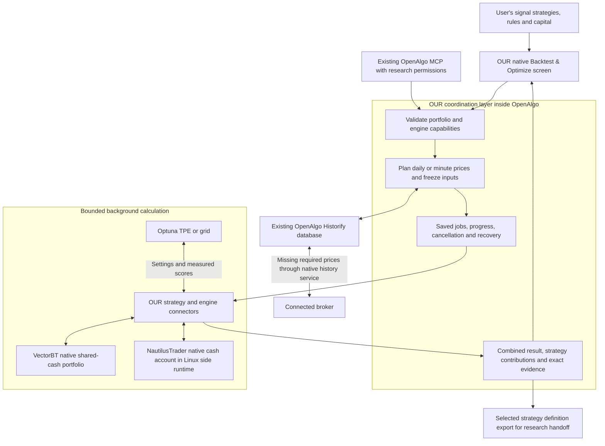

# What we are building and what ships

Implementation checkpoint: 9 September 2026. The joint portfolio workflow is
implemented; full VectorBT fixed and TPE/later-period runs, exact selected replay,
fresh Linux installation and populated reinstall are verified. The full-input
Nautilus v2 calculation also completed through the native Linux bridge. Local
preview acceptance is complete for the declared scope; Docker and cross-version
migrations are unverified. See
[STATUS.md](STATUS.md) for the latest verified boundary.

## One product

**OpenAlgo Research is a native Backtest & Optimize module, delivered in one
versioned OpenAlgo distribution.** A user installs that resource, signs in to
OpenAlgo, connects their broker through OpenAlgo and uses the research screen.
VectorBT, Optuna and the optional Nautilus runtime are calculation dependencies
behind that screen. There is no second research account or broker setup.

| Part | What it owns |
| --- | --- |
| OpenAlgo | Browser shell, login, broker and instrument services, history access and the existing Historify price archive. |
| Our product layer | Signal strategies, settings and allocations, data planning, compatible engine selection, bounded jobs, readable results and retained evidence. |
| VectorBT | Native order, fill, fee, cash and marked portfolio calculations for its supported signal adapter. |
| NautilusTrader | Alternative native event-driven fills, positions and account calculations under its distinct supported execution policy. |
| Optuna | Seeded adaptive TPE or grid proposals, objective-driven search and trial state. It calls the selected simulation engine through our connector. |

The user's idea lives in the product layer: combine signal strategies, choose
trade rules and shared capital, vary selected settings and allocations, and
understand the portfolio result and each strategy's contribution. We implement
the translation and workflow; the external engine performs account simulation.

## Current system

A fixed backtest makes one joint engine simulation. Optimization asks Optuna for
a complete set of strategy settings and allocations, simulates that whole
portfolio against the same frozen prices, and returns the measured score. It
never adds independent backtests together to approximate a shared account.
Optuna and the engine do not download broker data.

All strategies share one cash pool. Allocations cap deployed capital; they are
not separate funded accounts. Independent strategy and signal-lot identities
survive when strategies trade the same symbol. Native fills and cashflows support
per-strategy attribution that reconciles to the combined account.

## The consumer journey

1. Open Tools and the research screen at `/scanner-research`, titled
   **Backtest & Optimize**.
2. Upload a CSV or choose **Use saved signals**. Add up to eight strategies and
   set their trade rules and capital allocations.
3. Choose Backtest or Optimize. Optimization can vary strategy settings and
   allocations; an optional later-period check separates selection from testing.
4. Run. OpenAlgo selects the required candle interval, reuses stored prices,
   downloads missing required coverage and submits the frozen job.
5. Review the combined account chart, contributions, trades and trials. Reopen
   saved evidence, replay a selected trial exactly, or export its strategy
   definition for further research.

The saved-input picker uses the signed-in account's original sources and loads
compact pages, not price files. Selecting an input queues and downloads nothing.
Settings stay in strategy drawers and More settings. Internal evidence and policy
identifiers belong in detailed exports rather than routine screen narration.
Older scanner runs remain available separately, with their original evidence.

## Which historical data is used?

The same native OpenAlgo archive and history service are used. Research first
reads the required interval from Historify, requests missing required prices from
the currently connected broker through OpenAlgo, persists and reads them back
there, then records an immutable snapshot for the calculation. Research snapshots
preserve a run; they are not a competing mutable market-data database.

Date-only strategies remain daily unless their execution settings require
intraday information. Timestamped observations, intraday holding, minute holding
limits or explicit entry/exit clocks require one-minute prices. A mixed portfolio
uses the finest required interval for its whole account. The planner considers
the maximum holding window across the optimizer's allowed settings before any
trial, so candidates reuse the same input evidence.

A successfully requested but absent candle can exclude an affected signal window
from every trial, with the original signal and reason retained. A failed broker
request stops preparation and leaves progress resumable. It is not a successful
missing-candle response. Neither case authorizes invented prices or trade exits.
Complete stored coverage can be used without a current broker session.

## Frontends and runtime boundaries

| Tool | Interface used in this product |
| --- | --- |
| OpenAlgo | The installed browser app and our native React research screen. |
| VectorBT | Its Python simulation API; its plotting and notebook facilities are not a second consumer app in this distribution. |
| Optuna | Its Python study/sampler API. Our screen displays trading results and trials. The separate Optuna Dashboard is not integrated. |
| NautilusTrader | Its Python BacktestEngine in the included optional Linux runtime; there is no separate Nautilus browser account. |

The Optuna connector uses an in-memory study with saved research checkpoints.
Its files are not an Optuna RDB storage database that Dashboard can open directly.
Nautilus dependencies are separately locked so they do not require upgrading
OpenAlgo's core packages; the tested Windows route uses Linux through WSL.

## What is included, and what remains outside the scope?

The implemented contract supports up to eight CSV signal strategies for long NSE
cash equities, daily or one-minute data, shared capital, VectorBT or the bounded
Nautilus adapter, Optuna TPE/grid, later-period checks, exact saved-trial replay,
and authenticated native MCP research tools. [CONNECTORS.md](CONNECTORS.md)
records engine-specific differences and limits.

It does not import arbitrary native VectorBT/Nautilus programs or implement
shorts, derivatives, leverage, shared margin, observed-tick replay or an automatic
paper/live strategy deployment. The selected-definition export is a research
handoff with execution disabled. OpenAlgo's other trading tools remain separate
features; their broader capabilities are not research-connector capabilities.

The shipped resource includes the native UI, API/service hooks, worker, adapters,
locked dependency definitions, launcher and compatibility/source manifests. It
is a community OpenAlgo distribution with a separately versioned research module,
not a connectors folder that an unchanged host can load. Each installation owns
its own account, broker data and private research; those are not release contents.
No new public repository or public release has been published by this work.

For updates, maintainers integrate upstream OpenAlgo changes and test the host
hooks and each adapter against pinned supported versions. Users receive a tested
distribution release. Engine upgrades do not silently recalculate saved reports.
See [DISTRIBUTION.md](DISTRIBUTION.md) for installation and updates.

## Current acceptance boundary

Controlled integration and native-engine tests establish the implemented
behavior. They do not establish every broker account or every historical symbol.
The full 361-signal VectorBT fixed job completes with 356 eligible signals and
five price exclusions. The 25-proposal TPE/later-period run and exact selected
replay complete, with original evidence unchanged. A representative intraday run
uses 61 candles that match native Historify. Fresh Linux installation, real queued
calculations and an idempotent populated reinstall have passed.

The Nautilus v2 full-input check has 298 eligible signals and 63 explicit price
or instrument exclusions; its complete native calculation passed through the
Windows worker and WSL bridge, with all 1,995 frozen OHLC rows matching Historify.
The supplied current master is not historical-grid proof, and incompatible raw prices are not
rounded. [STATUS.md](STATUS.md) records this final verification boundary. Docker,
cross-version migrations and publication remain separate from these checks.

Implementation entry points: `frontend/src/pages/PortfolioResearch.tsx`,
`research/portfolio.py`, `services/research_portfolio.py`,
`research/connectors/vectorbt_portfolio.py`,
`research/connectors/nautilus_portfolio.py`,
`research/connectors/optuna_portfolio.py` and `services/research_mcp.py`.
