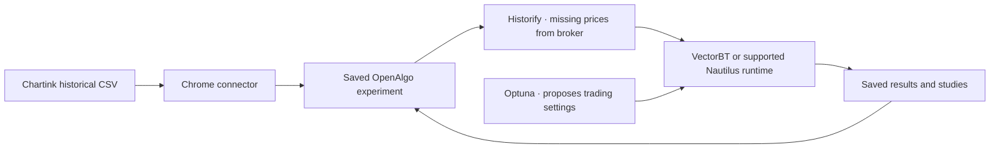

# Chartink → OpenAlgo Research


Send a scanner's historical signal export into a saved OpenAlgo Research experiment. Review the trading rules, run a backtest, then optimize supported settings without moving CSV files between apps.

This connector belongs to the same OpenAlgo Research project. Install **OpenAlgo Research preview.5 or newer**, which includes `/scanner-research/api/imports/chartink/capabilities` protocol 1. Earlier preview.4 is incompatible.

## Install the extension

**Extension 0.1.2 · Chrome 120+ · OpenAlgo Research preview.5+**

[**Download the extension ZIP**](https://github.com/mamamiya7/openalgo-research/releases/download/chartink-v0.1.2/openalgo-chartink-0.1.2.zip) · [Release and checksum](https://github.com/mamamiya7/openalgo-research/releases/tag/chartink-v0.1.2)

This is a free, manual installation. The extension is **not yet published on the Chrome Web Store**. No separate Chrome update is needed if you already use version 120 or newer.

1. **Start OpenAlgo Research.** Install [the app](https://github.com/mamamiya7/openalgo-research/releases/tag/research-v0.1.0-preview.6) with **Setup.cmd** on Windows or `bash setup-research.sh` on Linux, then create your account and sign in. On later visits, use **Start.cmd** or `bash start-research.sh`. Keep the launcher open. [App installation guide](https://github.com/mamamiya7/openalgo-research/blob/main/docs/research/RUNTIME.md).
2. **Download and extract the extension ZIP.** Keep the extracted folder in a permanent location; Chrome loads the extension from that folder. Use the named `openalgo-chartink-0.1.2.zip` asset, not GitHub's automatic Source code archive.
3. **Load it in Chrome.** Type `chrome://extensions` in the address bar, enable **Developer mode**, click **Load unpacked**, and select the extracted folder containing `manifest.json`. Do not select the ZIP itself. If working from this repository, select `extensions/chartink`.
4. **Pin it.** Open the puzzle-piece **Extensions** menu beside Chrome's address bar and pin **OpenAlgo Research — Chartink**.
5. **Connect it to your app.** Click the pinned icon. Enter the OpenAlgo address you already use to sign in, including its port—for example, `http://127.0.0.1:5000`—then click **Connect** and allow access. Use the same address consistently: `localhost` and `127.0.0.1` are different origins. Remote installations require HTTPS. No broker key or password is entered into the extension.

In Research preview.6, **Import from Chartink** in the Research library also opens an installation guide. Preview.5 supports the same import through the pinned extension even though it does not have that guide.

## Import your scanner and run research

1. Open a **Chartink scanner**, then open its **historical backtest results** and choose the period you want. Confirm that the historical **Download → CSV** export is available. Sign in to Chartink if required. Today's result table alone is not a historical signal export.
2. Click **Research in OpenAlgo** on the scanner page or in the pinned extension. The connector captures the official CSV for the selected history; you do not need to save and upload that file yourself.
3. OpenAlgo opens a **saved setup named after the scanner**, with its signals and source attached. Check the imported dates and symbols, then review capital, position size, entry, exits, holding period and costs.
4. Choose **Backtest**, or **Optimize** to review suggested ranges, objective and trial budget before running. The app reuses available Historify candles and fetches missing required prices through the connected broker. Connect your broker in OpenAlgo before requesting missing prices.
5. Return to the **Research library** to reopen your setup, results or studies. Importing unchanged history reuses the saved import; changed history creates related research while preserving earlier work.

**Importing saves a draft. It does not automatically download broker prices, run an optimization or place an order.** Chartink supplies signal dates and symbols; OpenAlgo handles the prices and calculations.

Already have a CSV? Open **Tools → Backtest & Optimize**, create a setup and upload it directly. The extension is optional.

## Update an existing extension

Download and extract the new extension ZIP into your existing extension folder, replacing its packaged files. At `chrome://extensions`, find **OpenAlgo Research — Chartink** and click **Reload**. Refresh any already-open Chartink scanner tabs. Confirm version **0.1.2** appears in the extension's **Details**, then reconnect if requested. No OpenAlgo restart is needed for an extension-only update, and saved research remains in the app.

If you choose a new folder instead, remove the old unpacked extension and load the new folder. Removing the extension clears its local connection settings; reconnect to OpenAlgo afterward. Do not keep two copies enabled.

## If something does not open

| What you see | What to do |
| --- | --- |
| Chrome cannot load the extension | Extract the ZIP first, then select the folder that directly contains `manifest.json`. |
| OpenAlgo cannot be reached | Start OpenAlgo, sign in in Chrome, and reconnect to that exact address and port. |
| Login interrupts an import | Sign in to OpenAlgo, reopen the extension and choose **Continue import**. |
| No historical export is found | Open the scanner's historical backtest, select an available period and check **Download → CSV**. Sign in to Chartink if required. |
| The scanner-page button is missing | Refresh the scanner after installation or use the pinned extension. Confirm Chrome allows access to Chartink. |
| The app is incompatible | Install OpenAlgo Research preview.5 or newer; plain upstream OpenAlgo and Research preview.4 do not include this import protocol. |

[Report a problem](https://github.com/mamamiya7/openalgo-research/issues) with your extension/app versions and the visible error. Do not include passwords, broker keys or private scanner exports.

## What flows between the apps



- **Chartink supplies signal observations**, including dates/times and symbols. The connector captures Chartink's official historical CSV, not today's current result table, chart tooltip samples, or reconstructed historical prices.
- **OpenAlgo owns the account, setup, library and data plan.** The backend retains the original UTF-8 CSV bytes, source URL/title, selected-period label, capture time, any visible repaint notice and a content fingerprint.
- **Historify supplies matching cached candles; the existing OpenAlgo broker adapter fills missing coverage.** Engine and trading rules participate in selecting the resolution. A date-only export is not automatically a request for minute data. An execution rule that needs intraday sequencing can still require it. No extension-owned price store is created.
- **VectorBT is the default simulator; Nautilus is an optional supported alternative. Optuna proposes supported settings to the chosen simulator.** Importing a scanner CSV does not make its RSI/SMA/scanner conditions optimizable: those require a separate signal-generation connector.
- **Results save automatically.** Capture only creates a draft; price downloads and calculations begin when the user launches research. The connector never places orders.

New Chartink imports begin with one long NSE cash strategy, 100% strategy allocation, the application's visible trading defaults, Backtest mode and a 25-trial search budget. These are editable starting assumptions, not inferred trading intent. A changed-history child retains applicable previous rules/capital/search settings but resets date filters and validation splits for review.

## Recovery and privacy

Only the chosen scanner's export is captured when you click. The connector uses Chartink access for its page button and asks for your chosen OpenAlgo host when connecting. It does not read broker credentials, cookie values, unrelated tabs' content or general browsing history, and makes no analytics requests. It does handle the selected scanner's URL/title. See the [bundled privacy policy](privacy.html), also available offline from the popup.

One pending import, at most 8 MiB of CSV, is held in Chrome **session** storage. It becomes unavailable after one hour; a subsequent cleanup removes expired bytes. It is removed after acknowledgment or **Discard** and cleared when the browser session ends. Chrome's quota may require a shorter period for unusually large exports. Only your OpenAlgo address/status and the last saved experiment's title/link persist locally. Nothing uses Chrome sync storage. Removing the extension does not delete work already saved in OpenAlgo.

If login or a connection failure interrupts the handoff, sign in and choose **Continue import** in the extension. Retry returns the same saved import rather than duplicating it. A pending capture from one tab cannot be claimed by a different tab or a different OpenAlgo origin. After a full Chrome restart, capture again; the server also recognizes unchanged saved history.

Original evidence belongs to the signed-in OpenAlgo account. Archiving hides saved research; it does not erase the original export. Deletion depends on the installation's retention and administrator controls, and the library restricts deleting experiments with saved runs or versions. The extension does not set live/sandbox mode, start scheduled strategies, or send orders.

## Supported boundary

This connector supports Chartink screener pages whose historical export includes a date and symbol. It depends on the visible historical export controls remaining available. It does not bypass access requirements or guarantee every Chartink layout. Other scanner websites are not supported. Each capture opens its saved or related experiment; the extension does not append a new strategy to an existing multi-strategy experiment.

The application's current release scope remains long NSE cash equities. Broker compatibility and supported candle history come from OpenAlgo's existing adapters; this implementation does not establish that every broker or instrument has been tested.

## Developer checks and package

```sh
cd extensions/chartink
npm ci
npm test
python package.py
python -m unittest discover -s . -p test_package.py
```

The package goes under ignored `.agent-native/chartink-package/` with a SHA-256 checksum and `manifest.json` at the ZIP root. The explicit allowlist includes runtime files, original icons, the offline policy, README and license/notices: no credentials, exported signals, account data, dependencies or test fixtures. Tests simulate the visible official export mechanism, preserve BOM/CRLF, cover bounded failure cleanup and exercise the scoped delivery protocol. Package checks cover reproducibility, required assets and accidental file inclusion. Native application tests cover authenticated import, source reuse, ownership, durable evidence and the calculation path separately.

This is an independent community connector, not an official or endorsed Chartink or upstream OpenAlgo extension. [License](License.md) · [Notices](NOTICE.md) · [Prepared store copy](https://github.com/mamamiya7/openalgo-research/blob/main/docs/research/CHARTINK_STORE_LISTING.md).
