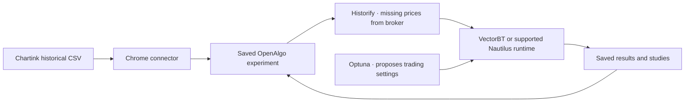

# Chartink → OpenAlgo Research


Send a scanner's historical signal export into a saved OpenAlgo Research experiment. Review the trading rules, run a backtest, then optimize supported settings without moving CSV files between apps.

This connector belongs to the same OpenAlgo Research project. It requires the matching application source with `/scanner-research/api/imports/chartink/capabilities` protocol 1; the earlier preview.4 release alone does not contain that endpoint.

## Install and test

1. Install/run the matching OpenAlgo Research application using the project's [installation guide](https://github.com/mamamiya7/openalgo-research/blob/main/docs/research/RUNTIME.md). The connector endpoint must be present in that source; preview.4 alone is insufficient. Sign in with your normal OpenAlgo account.
2. In Chrome, open `chrome://extensions`, enable **Developer mode**, select **Load unpacked**, and choose this `extensions/chartink` folder. Alternatively extract the packaged ZIP and choose the folder containing `manifest.json`.
3. Open the extension from Chrome's toolbar. Enter the OpenAlgo address you use to sign in, such as `http://127.0.0.1:5000`, then choose **Connect** and allow access to that address. Remote installations require HTTPS. No broker key or password is entered into the extension.
4. Visit a Chartink scanner and open its historical backtest results. Choose the period you want and make sure Chartink's historical **Download → CSV** export is available. Sign in to Chartink if required.
5. Click **Research in OpenAlgo** on the scanner, or use the extension's toolbar button. OpenAlgo opens a saved experiment named after the scanner, with the signals attached.
6. Review capital, position size, entry, exits, holding period and costs. Choose **Backtest**. The app uses its existing Historify/broker workflow to prepare the necessary prices and saves the result in the library.
7. Choose **Optimize** to populate suggested ranges for supported settings. Review the visible ranges, objective and trial budget, then run. Existing custom search ranges and saved trial budgets are retained.
8. Return to the library and reopen the experiment/result. Capture the same history again to check duplicate reuse; capture changed history to create a related experiment while keeping earlier work intact.

The first installation in Chrome requires a manual **Load unpacked** action. Version **0.1.1** adds the original logo, privacy/help links and store-ready ZIP layout. For an existing unpacked installation, choose **Reload** at `chrome://extensions` after updating its files. This package has not been submitted to the Chrome Web Store. The [public release guide](https://github.com/mamamiya7/openalgo-research/blob/main/docs/research/CHROME_EXTENSION_PUBLISHING.md) accompanies this version's source publication; new documentation links become available when that source is pushed.

## What flows between the apps



- **Chartink supplies signal observations**, including dates/times and symbols. The connector captures Chartink's official historical CSV, not today's current result table, chart tooltip samples, or reconstructed historical prices.
- **OpenAlgo owns the account, setup, library and data plan.** The backend retains the original UTF-8 CSV bytes, source URL/title, selected-period label, capture time, any visible repaint notice and a content fingerprint.
- **Historify supplies matching cached candles; the existing OpenAlgo broker adapter fills missing coverage.** Engine and trading rules participate in selecting the resolution. A date-only export is not automatically a request for minute data. An execution rule that needs intraday sequencing can still require it. No extension-owned price store is created.
- **VectorBT is the default simulator; Nautilus is an optional supported alternative. Optuna proposes supported settings to the chosen simulator.** Importing a scanner CSV does not make its RSI/SMA/scanner conditions optimizable: those require a separate signal-generation connector.
- **Results save automatically.** Capture only creates a draft; price downloads and calculations begin when the user launches research. The connector never places orders.

New Chartink imports begin with one long NSE cash strategy, 100% strategy allocation, the application's visible trading defaults, Backtest mode and a 25-trial search budget. These are editable starting assumptions, not inferred trading intent. A changed-history child retains applicable previous rules/capital/search settings but resets date filters and validation splits for review.

## Recovery and privacy

Only the chosen scanner's export is captured when you click. The connector uses Chartink access for its page button and asks for your chosen OpenAlgo host when connecting. It does not read broker credentials, cookie values, unrelated tabs' content or general browsing history, and makes no analytics requests. It does handle the selected scanner's URL/title. See the [bundled privacy policy](privacy.html), also available offline from the popup.

One pending import, at most 8 MiB of CSV, is held in Chrome **session** storage. It becomes unavailable after one hour; a subsequent cleanup removes expired bytes. It is removed after acknowledgment or **Discard** and cleared when the browser session ends. Chrome's quota may require a shorter period for unusually large exports. Only your OpenAlgo address/status and the last saved experiment's title/link persist locally. Nothing uses Chrome sync storage. Removing the extension does not delete work already saved in OpenAlgo.

If login or a connection failure interrupts the handoff, sign in and choose **Continue import** in the extension. Retry returns the same saved import rather than duplicating it. A pending capture from one tab cannot be claimed by a different tab or a different OpenAlgo origin. After a full Chrome restart, capture again; the server also recognizes unchanged saved history.

Original evidence belongs to the signed-in OpenAlgo account. Archiving hides saved research; it does not erase the original export. Deletion depends on the installation's retention and administrator controls, and the library restricts deleting experiments with saved runs or versions. The extension does not set live/sandbox mode, start scheduled strategies, or send orders.

## Supported boundary

This first connector supports Chartink screener pages whose historical export includes a date and symbol. It depends on the visible historical export controls remaining available. It does not bypass access requirements or guarantee every Chartink layout. Other scanner websites, adding a capture into an existing multi-strategy experiment, reusable personal presets, rich study plots, candidate shortlists and saved comparisons remain separate journey work.

The application's current release scope remains long NSE cash equities. Broker compatibility and supported candle history come from OpenAlgo's existing adapters; this implementation does not establish that every broker or instrument has been tested.

## Developer checks and package

```sh
cd extensions/chartink
npm ci
npm test
python package.py
python -m unittest discover -s . -p test_package.py
```

The package goes under ignored `.agent-native/chartink-package/` with a SHA-256 checksum and `manifest.json` at the ZIP root. The explicit allowlist includes runtime files, original icons, the offline policy, README and license/notices: no credentials, exported signals, account data, dependencies or test fixtures. Tests simulate the visible official export mechanism, preserve BOM/CRLF, cover bounded failure cleanup and exercise the scoped delivery protocol. Package checks cover reproducibility, required assets and accidental file inclusion. Native application tests cover authenticated import, source reuse, ownership, durable evidence and the calculation path separately.

This is an independent community connector, not an official or endorsed Chartink or upstream OpenAlgo extension. [License](License.md) · [Notices](NOTICE.md) · [Prepared store copy](https://github.com/mamamiya7/openalgo-research/blob/main/docs/research/CHARTINK_STORE_LISTING.md).
